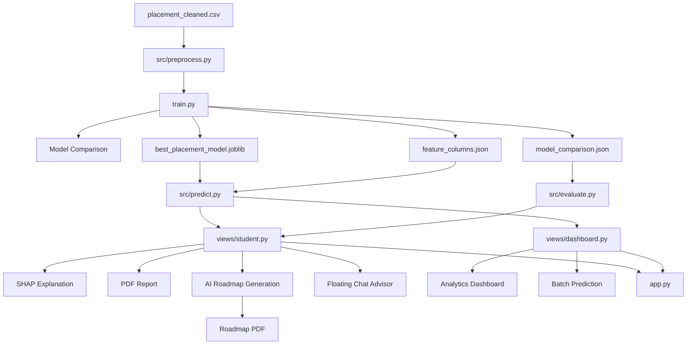

# Placement Prediction System Codebase Explanation Report

## 1. Introduction

### 1.1 Project Overview

This project is an end-to-end **AI-Powered Student Placement Intelligence Platform** built to estimate whether a student is likely to get placed based on academic, skill, and profile-related features. It combines:

- a classical machine learning pipeline for placement prediction,
- explainable AI using SHAP,
- an interactive Streamlit web application,
- analytics dashboards for Training and Placement teams,
- personalized AI-generated placement guidance using Azure OpenAI,
- and PDF report generation for both prediction summaries and long-term roadmaps.

The project is not only a prediction model. It is a complete application that covers the full lifecycle of a placement-support platform:

1. preparing and preprocessing historical student data,
2. training and comparing multiple ML models,
3. saving the best model and its metadata,
4. accepting fresh student inputs through a UI,
5. generating prediction probabilities,
6. explaining the prediction with SHAP,
7. producing recommendations and PDF reports,
8. and offering AI-based roadmap generation and advisor chat support.

### 1.2 Main Objective

The main objective of the system is to help students and placement officers answer the question:

**"Based on the current profile of a student, how likely is that student to be placed, and what should be improved to increase that probability?"**

### 1.3 Target Users

The codebase clearly supports two user groups:

- **Students**
  Students can enter their own profile details, receive a placement prediction, inspect the probability, understand key factors affecting the result, download a PDF report, and generate a personalized placement roadmap.

- **Training and Placement (T&P) Teams**
  Placement officers can upload CSV files to analyze student datasets, inspect placement distributions and correlations, identify at-risk students, and perform batch prediction for many students at once.

---

## 2. Problem Statement and Solution Approach

### 2.1 Problem Statement

Campus placements depend on many factors such as academic performance, aptitude, projects, internships, backlog history, and technical skills. It is difficult for students and institutions to manually estimate placement readiness for each student in a consistent and data-driven way.

### 2.2 Proposed Solution

This system solves that problem by:

- training machine learning classifiers on historical placement data,
- learning relationships between student features and final placement outcomes,
- using the trained model to predict new student outcomes,
- adding interpretability through SHAP so predictions are explainable,
- and extending the solution with generative AI to turn predictions into action plans.

This makes the project a strong combination of:

- **predictive analytics**,
- **explainable AI**,
- **interactive decision support**,
- and **personalized advisory tooling**.

---

## 3. Repository Structure

The codebase is organized in a simple and practical way.

```text
placement-prediction-system/
├── app.py
├── train.py
├── config.yaml
├── requirements.txt
├── README.md
├── CODEBASE_EXPLANATION_REPORT.md
├── data/
│   └── placement_cleaned.csv
├── model/
│   ├── best_placement_model.joblib
│   ├── feature_columns.json
│   └── model_comparison.json
├── src/
│   ├── __init__.py
│   ├── advisor.py
│   ├── evaluate.py
│   ├── predict.py
│   ├── preprocess.py
│   ├── report_gen.py
│   ├── roadmap_gen.py
│   └── roadmap_pdf.py
├── views/
│   ├── __init__.py
│   ├── dashboard.py
│   └── student.py
└── notebooks/
    └── Untitled.ipynb
```

### 3.1 Folder Responsibilities

- `data/`
  Stores the cleaned CSV dataset used during model training.

- `model/`
  Stores model artifacts generated after training:
  - serialized best model,
  - saved feature column order,
  - evaluation metrics for all compared models.

- `src/`
  Contains reusable application logic such as preprocessing, prediction, evaluation, OpenAI integration, roadmap generation, and PDF generation.

- `views/`
  Contains Streamlit page-level UI logic.

- `app.py`
  Main Streamlit entry point and page router.

- `train.py`
  Offline model training pipeline.

---

## 4. Dataset Description

### 4.1 Dataset File

The project uses:

- `data/placement_cleaned.csv`

### 4.2 Dataset Size

From the current repository data file:

- Total rows: **200**
- Total columns: **14**

### 4.3 Raw Dataset Columns

The dataset contains the following columns:

1. `Student_ID`
2. `Name`
3. `Gender`
4. `Branch`
5. `10th_Percentage`
6. `12th_Percentage`
7. `BTech_CGPA`
8. `No_of_Projects`
9. `Internships`
10. `Technical_Skills_Count`
11. `Soft_Skills_Rating`
12. `Backlogs`
13. `Aptitude_Score`
14. `Placement_Status`

### 4.4 Target Variable

The target column is:

- `Placement_Status`

This is a binary output:

- `1` means the student is placed
- `0` means the student is not placed

### 4.5 Class Distribution

The current dataset distribution is:

- Placed (`1`): **142**
- Not placed (`0`): **58**

This shows a class imbalance in favor of placed students. The code addresses this imbalance using **SMOTE** during training.

### 4.6 Categorical Distribution

Current category distribution in the dataset:

- Gender:
  - Male: 124
  - Female: 76

- Branch:
  - CSE: 38
  - ME: 37
  - CE: 34
  - EEE: 32
  - IT: 30
  - ECE: 29

---

## 5. Configuration Layer

### 5.1 `config.yaml`

The configuration file centralizes important constants:

```yaml
paths:
  data: "data/placement_cleaned.csv"
  model: "model/best_placement_model.joblib"
  features: "model/feature_columns.json"
  comparison: "model/model_comparison.json"

model:
  target_column: "Placement_Status"
  drop_columns: ["Student_ID", "Name"]
  test_size: 0.2
  random_state: 42
  smote_random_state: 42

app:AI-Powered Student Placement Intelligence Platform
  title: ""
  placement_threshold: 0.5
```

### 5.2 Meaning of Configuration Entries

- `paths.data`
  Path of the training dataset.

- `paths.model`
  Path where the final trained model should be saved.

- `paths.features`
  Path where the ordered list of engineered feature columns is stored.

- `paths.comparison`
  Path where model comparison results are stored as JSON.

- `model.target_column`
  Column to be predicted.

- `model.drop_columns`
  Non-predictive identifier columns removed before training.

- `model.test_size`
  Fraction of the dataset reserved for testing.

- `model.random_state`
  Ensures reproducibility of train/test split and some models.

- `model.smote_random_state`
  Ensures reproducibility of SMOTE oversampling.

- `app.placement_threshold`
  Conceptually represents a probability threshold for class labeling, though in the current implementation the prediction label comes directly from `model.predict()` rather than this config value.

---

## 6. High-Level System Architecture

The codebase can be understood as five cooperating layers.

### 6.1 Architecture Layers

1. **Data Layer**
   - CSV dataset in `data/`
   - saved artifacts in `model/`

2. **Preprocessing and ML Layer**
   - feature engineering,
   - train/test split,
   - SMOTE balancing,
   - model training and evaluation.

3. **Inference Layer**
   - artifact loading,
   - input alignment,
   - single-student and batch prediction.

4. **Presentation Layer**
   - Streamlit student page,
   - Streamlit dashboard page,
   - charts, controls, downloads.

5. **AI and Reporting Layer**
   - SHAP explainability,
   - Azure OpenAI roadmap generation,
   - floating placement chatbot,
   - PDF generation.

### 6.2 Architecture Flow Diagram



---

## 7. End-to-End Execution Flow

### 7.1 Offline Training Flow

The training flow starts when:

```bash
python train.py
```

The steps are:

1. `train.py` calls `load_and_preprocess()` from `src/preprocess.py`.
2. The dataset is loaded from `data/placement_cleaned.csv`.
3. Identifier columns `Student_ID` and `Name` are dropped.
4. Features and target are separated.
5. Categorical columns are one-hot encoded using `pd.get_dummies(..., drop_first=True)`.
6. Data is split into training and test sets using stratified sampling.
7. SMOTE is applied **only on the training set** to balance the classes.
8. Six ML models are trained and evaluated.
9. Metrics such as accuracy, precision, recall, F1, ROC-AUC, and 5-fold CV accuracy are computed.
10. The best model is chosen based on **highest weighted F1 score**.
11. Optional hyperparameter tuning is applied for Random Forest or XGBoost only.
12. Final artifacts are saved to the `model/` folder.

### 7.2 App Startup Flow

When the application is launched with:

```bash
streamlit run app.py
```

the flow is:

1. `app.py` sets page configuration and injects global CSS.
2. It imports `views.student` and `views.dashboard`.
3. The sidebar radio decides which page to render.
4. The selected page’s `show()` function is called.
5. If a student prediction exists in session state, the floating advisor chat is rendered on top of the student page.

### 7.3 Student Prediction Flow

The student page follows this sequence:

1. Student enters profile data through form controls.
2. Skills are selected from predefined and custom options.
3. A `student_dict` is created.
4. `predict_student()` converts that dictionary into model-ready features.
5. The saved model generates:
   - placement probability,
   - placement class label.
6. The result is stored in `st.session_state`.
7. The page then:
   - computes SHAP explanation,
   - shows a gauge chart,
   - shows a radar chart,
   - lists top SHAP factors,
   - displays personalized recommendations,
   - allows roadmap generation,
   - and enables PDF downloads.

### 7.4 Dashboard Flow

The T&P dashboard has two modes:

- **Upload & Analyze**
  Used for descriptive analytics on a CSV dataset.

- **Batch Prediction**
  Used to run model predictions on many students and download the results.

### 7.5 AI Roadmap Flow

When the user clicks **Generate My Placement Roadmap**:

1. Top SHAP features are converted into a compact list of influential factors.
2. Selected skills are used to detect the student’s likely target field.
3. `src/roadmap_gen.py` builds a prompt.
4. Azure OpenAI is called through `src/advisor.py`.
5. The model returns a JSON roadmap.
6. The roadmap is shown inside the UI.
7. `src/roadmap_pdf.py` can convert that roadmap into a styled PDF.

---

## 8. Training Pipeline in Detail

### 8.1 `train.py`

This is the central training script. It orchestrates model creation, model evaluation, model selection, optional tuning, and artifact saving.

### Functions in `train.py`

#### `get_models()`

Returns a dictionary of candidate models:

- Logistic Regression
- Random Forest
- XGBoost
- Gradient Boosting
- SVM
- KNN

This provides a multi-model experimentation setup rather than assuming one model from the start.

#### `evaluate_all_models(models, X_train, X_test, y_train, y_test)`

This function:

- trains each model,
- predicts on the test set,
- computes predicted probabilities,
- evaluates performance,
- runs 5-fold cross-validation on training data,
- stores each model’s metrics in a list,
- and stores the fitted models in a dictionary.

Metrics computed:

- accuracy
- precision
- recall
- F1 score
- ROC-AUC
- CV mean accuracy
- CV standard deviation

This is the core experimental comparison step of the project.

#### `tune_best_model(fitted_models, results, X_train, y_train)`

This function:

1. finds the best model by maximum F1 score,
2. checks whether the model is Random Forest or XGBoost,
3. if yes, runs `RandomizedSearchCV`,
4. if not, skips tuning and returns the already fitted best model.

Important current behavior:

- The best model in the saved comparison results is **Logistic Regression** by weighted F1.
- Because tuning logic is implemented only for Random Forest and XGBoost, the best model is returned without additional hyperparameter search in the current artifact set.

#### `save_artifacts(model, feature_cols, results)`

This function writes:

- `best_placement_model.joblib`
- `feature_columns.json`
- `model_comparison.json`

These files are what make the app runnable after training.

### Main Execution Block

The `if __name__ == "__main__":` section:

- configures logging,
- starts preprocessing,
- evaluates all models,
- tunes the selected best model if applicable,
- saves artifacts,
- prints completion instructions.

---

## 9. Preprocessing Pipeline

### 9.1 `src/preprocess.py`

This file is responsible for loading project configuration and preparing the dataset for training.

### `load_config()`

Purpose:

- reads `config.yaml`,
- parses it using `yaml.safe_load`,
- returns a Python dictionary.

Why it matters:

- prevents hardcoding of key preprocessing values inside the pipeline.

### `load_and_preprocess()`

This is one of the most important functions in the project.

It performs the following operations:

1. loads config values,
2. reads the CSV dataset,
3. drops `Student_ID` and `Name`,
4. splits the dataframe into `X` and `y`,
5. performs one-hot encoding,
6. saves the encoded feature names,
7. performs train/test split using stratification,
8. applies SMOTE only to the training subset,
9. returns processed training data, test data, target vectors, and feature column names.

### Why `drop_first=True` is Important

`pd.get_dummies(..., drop_first=True)` avoids full dummy-variable redundancy by dropping one category from each categorical group.

In the current trained feature schema, the saved columns are:

- `Gender_Male`
- `Branch_CSE`
- `Branch_ECE`
- `Branch_EEE`
- `Branch_IT`
- `Branch_ME`

This means the omitted branch category acts as the baseline category. Given the branch values present in the dataset and UI, that implicit baseline is effectively **CE**.

### Why SMOTE is Used

The original dataset is imbalanced:

- 142 placed
- 58 not placed

If the model were trained directly on this data, it could become biased toward predicting the majority class. SMOTE synthetically generates minority-class training examples to improve balance and help the model learn the "not placed" class more effectively.

### Strength of the Implementation

A good design choice here is that SMOTE is applied only to `X_train` and `y_train`, not to the test set. That preserves fair evaluation.

---

## 10. Model Comparison and Evaluation

### 10.1 Models Compared

The project evaluates six algorithms:

1. Logistic Regression
2. Random Forest
3. XGBoost
4. Gradient Boosting
5. SVM
6. KNN

This is useful in a project report because it shows that model selection was empirical rather than arbitrary.

### 10.2 Saved Evaluation Results

The repository already contains `model/model_comparison.json` with these values:

| Model | Accuracy | Precision | Recall | F1 | ROC-AUC | CV Mean |
| --- | ---: | ---: | ---: | ---: | ---: | ---: |
| Logistic Regression | 0.8250 | 0.8204 | 0.8250 | 0.8169 | 0.8423 | 0.8381 |
| Random Forest | 0.8250 | 0.8299 | 0.8250 | 0.8091 | 0.8542 | 0.8600 |
| XGBoost | 0.7750 | 0.7645 | 0.7750 | 0.7646 | 0.8095 | 0.8294 |
| Gradient Boosting | 0.8000 | 0.8000 | 0.8000 | 0.8000 | 0.8452 | 0.8509 |
| SVM | 0.6250 | 0.6714 | 0.6250 | 0.6389 | 0.3125 | 0.6129 |
| KNN | 0.5500 | 0.6091 | 0.5500 | 0.5680 | 0.5729 | 0.8074 |

### 10.3 Selected Best Model

The project chooses the best model using **highest weighted F1 score**.

Based on the saved artifacts, the selected model is:

- **Logistic Regression**

### Why F1 Score Was a Good Choice

Because the dataset is imbalanced, F1 score is often more informative than accuracy alone. Accuracy could look high even if the model performs poorly on the minority class. F1 better balances precision and recall.

### Important Interpretation

- Logistic Regression gives the best F1.
- Random Forest gives the best ROC-AUC and CV mean accuracy.

This means the final model was not chosen because it was best in every metric, but because it best satisfied the project’s chosen selection criterion.

---

## 11. Inference Pipeline

### 11.1 `src/predict.py`

This file handles inference-time artifact loading and single-student prediction.

### `load_artifacts()`

Loads:

- the serialized model using `joblib.load`,
- the ordered feature column list using JSON.

Why this matters:

- the model alone is not enough,
- the app must also know the exact training-time feature order.

### `predict_student(student_dict, model, feature_cols)`

This function transforms live user input into the same format used during training.

Steps:

1. Convert the input dictionary into a one-row DataFrame.
2. Apply one-hot encoding with `pd.get_dummies`.
3. Add any missing training columns with value `0`.
4. Reorder columns to match `feature_cols`.
5. Run `predict_proba()` to get placement probability.
6. Run `predict()` to get the binary label.

Outputs:

- `prob`: probability of class 1
- `pred`: predicted class label

### Why Feature Alignment Is Critical

When one-hot encoding is performed on a single-row student input, many training columns may not appear naturally. Without column alignment, the model would receive the wrong shape or wrong ordering. The loop that fills missing columns with zero is therefore essential.

---

## 12. Evaluation Artifact Reader

### 12.1 `src/evaluate.py`

This file provides lightweight helpers for reading the model comparison artifact.

### `load_comparison_results()`

Reads `model_comparison.json`, converts it into a DataFrame, rounds numeric columns, and returns a clean table for display in Streamlit.

### `get_best_model_name(df)`

Returns the model name corresponding to the highest F1 score.

This module is mainly used for showing model performance in the UI rather than for training.

---

## 13. Streamlit Application Entry Point

### 13.1 `app.py`

This file is the runtime entry point of the web application.

### Responsibilities of `app.py`

- set Streamlit page configuration,
- inject global CSS for layout and floating chat behavior,
- display the application title,
- let the user choose between pages through a sidebar radio,
- route to `student.show()` or `dashboard.show()`,
- and render the floating advisor widget when a prediction exists.

### Page Routing Logic

The page router is simple:

- `Student Prediction` -> `views.student.show()`
- `T&P Dashboard` -> `views.dashboard.show()`

### Session-State Driven Overlay

If a prediction result exists in `st.session_state["latest_prediction"]`, the student page’s floating chat advisor is rendered with context such as:

- `student_dict`
- `prob`
- `skills`
- `pred`

This is how the chat widget becomes aware of the latest student profile.

---

## 14. Student Prediction Page

### 14.1 `views/student.py`

This is the largest file in the repository and the most feature-rich part of the project. It acts as the main user-facing orchestration layer for:

- manual student input,
- model prediction,
- SHAP explanation,
- charts,
- recommendations,
- AI roadmap generation,
- PDF downloads,
- and floating advisor chat.

### 14.2 Module-Level Initialization

At import time, this file loads:

- the trained model and feature columns via `load_artifacts()`,
- the model comparison table via `load_comparison_results()`.

This design keeps later UI actions fast because artifacts are already available.

### 14.3 Important Constants

#### `FEATURE_LABELS`

Maps internal feature names to readable display labels for UI and SHAP explanation.

Examples:

- `BTech_CGPA` -> `B.Tech CGPA`
- `No_of_Projects` -> `No. of Projects`
- `Gender_Male` -> `Gender (Male)`

#### `SKILL_OPTIONS`

A long predefined skill list used for the multiselect input. It includes skills across:

- programming,
- web development,
- AI/ML,
- cloud,
- databases,
- mobile,
- cybersecurity,
- CAD,
- DSA,
- and more.

This list is especially useful for roadmap generation, because selected skills are later used to infer the student’s probable target field.

### 14.4 Helper Functions

#### `_escape_html(value)`

Escapes text to safe HTML entities before injecting custom markup into Streamlit.

#### `_render_shap_inline_table(shap_df)`

Displays the top SHAP values as an inline bar-table.

It:

- picks top features,
- normalizes absolute SHAP values,
- assigns positive or negative styles,
- renders a compact HTML layout.

#### `render_floating_chat(student_dict, prob, skills, pred)`

This function builds a fully custom floating chat widget using `streamlit.components.v1.html`.

It:

- constructs a system prompt containing the student’s exact profile,
- injects Azure OpenAI endpoint and key details,
- creates a front-end chat UI in HTML/CSS/JavaScript,
- makes direct browser-side API calls to Azure OpenAI chat completions,
- formats AI responses with bold text, bullets, and numbered sections.

This is a major AI feature of the project because it turns the prediction result into a conversational guidance tool.

### 14.5 `show()`

This is the main page-rendering function.

It performs the following blocks of work.

#### Block 1: Page Styling and Header

Custom CSS is added to:

- reduce default Streamlit padding,
- format section cards,
- style the SHAP table,
- float the custom chat iframe above the app viewport.

#### Block 2: Model Information Panel

The user can expand a section showing model comparison metrics. The active model is derived from the highest F1 score in `comparison_df`.

#### Block 3: Input Form

The page collects:

- 10th percentage,
- 12th percentage,
- BTech CGPA,
- number of projects,
- internships,
- technical skills,
- soft skills rating,
- aptitude score,
- backlogs,
- gender,
- branch.

This matches the trained feature space used by the model.

#### Block 4: Student Skill Handling

The page stores selected skills in session state and supports:

- multiselect from a predefined list,
- optional custom skill input,
- automatic calculation of `Technical_Skills_Count`.

#### Block 5: Prediction Trigger

When the user clicks **Predict Placement**:

- a `student_dict` is created,
- `predict_student()` is called,
- probability and label are stored in session state.

#### Block 6: SHAP Explanation

If a prediction is present, the code attempts to generate SHAP explanations.

Current SHAP workflow:

1. rebuild one-row student dataframe,
2. align columns with training features,
3. reload preprocessed training data using `load_and_preprocess()`,
4. create a background dataset from `X_train`,
5. sample up to 50 background rows using `shap.sample`,
6. create a `shap.KernelExplainer`,
7. compute SHAP values with `nsamples=100`,
8. build a ranked dataframe of top features.

The code then identifies a **key risk factor** by choosing the most negative SHAP value.

#### Block 7: Result Visualizations

The page displays:

- a result metric card,
- probability metric,
- key risk factor metric,
- a Plotly gauge chart for probability,
- and a Plotly radar chart summarizing student strengths.

#### Block 8: Personalized Placement Roadmap

When the user clicks **Generate My Placement Roadmap**:

- SHAP factors are transformed into a simple list,
- `generate_roadmap()` is called,
- the AI-generated roadmap is stored in session state,
- roadmap phases, companies, skills, and quick wins are displayed,
- roadmap PDF becomes downloadable.

#### Block 9: PDF Downloads

The page allows the user to download:

- a standard placement report PDF from `src/report_gen.py`,
- a longer roadmap PDF from `src/roadmap_pdf.py`.

#### Block 10: Rule-Based Recommendations

Independent of the generative roadmap, the page also provides hand-written recommendations such as:

- clear backlogs,
- improve CGPA,
- do more projects,
- add technical skills,
- complete internships,
- practice aptitude.

This is useful because it ensures the user gets actionable feedback even if AI generation is unavailable.

---

## 15. SHAP Explainability Design

SHAP is one of the strongest technical components of the project because it converts a raw model prediction into an interpretable explanation.

### 15.1 Why SHAP is Used

A probability alone is not sufficient in many educational decision-support systems. SHAP helps answer:

- which features increased the placement probability,
- which features decreased it,
- and which factor is currently the biggest risk.

### 15.2 How SHAP Is Implemented

The project uses:

- `shap.KernelExplainer`

with:

- model function: `model.predict_proba`
- background sample: `shap.sample(background, 50)`
- explanation budget: `nsamples=100`

### 15.3 Output Produced

The code turns SHAP output into a dataframe with:

- `Feature`
- `SHAP Value`
- `Impact`

Then it sorts by absolute contribution and displays the most influential features.

### 15.4 Why This Matters in a Project Report

This makes the system more than a black-box classifier. It becomes an **explainable AI application**, which is important in academic projects because it improves interpretability, trust, and decision usefulness.

---

## 16. T&P Dashboard Page

### 16.1 `views/dashboard.py`

This page is designed for placement officers or administrators rather than individual students.

### Module-Level Initialization

The file loads the trained model and feature columns at import time.

### Main Function: `show()`

This function builds the dashboard with two tabs.

### Tab 1: `Upload & Analyze`

This tab provides descriptive analytics for an uploaded CSV.

Features include:

- dataset preview,
- total student count,
- number placed,
- number not placed,
- placement rate metric,
- pie chart for placement ratio,
- histogram for placement by branch,
- box plot for CGPA by placement,
- box plot for projects by placement,
- correlation heatmap for numeric columns,
- at-risk student table if identifiers are available.

This tab is primarily for diagnostic and exploratory analysis.

### Tab 2: `Batch Prediction`

This tab performs bulk inference on a user-uploaded CSV.

Process:

1. user uploads a CSV,
2. expected columns are validated,
3. the app loops through each row,
4. each row is converted into a `student_dict`,
5. `predict_student()` is called per row,
6. results are appended to the dataframe,
7. summary metrics are displayed,
8. the output CSV becomes downloadable.

Output columns added:

- `Placement_Prediction`
- `Placement_Probability_%`
- `Result`

### Significance

This turns the project from an individual prediction tool into an institutional analytics tool.

---

## 17. PDF Report Generation

### 17.1 `src/report_gen.py`

This file generates the standard student placement PDF report using `fpdf2`.

### Important Elements

#### `REPORT_FEATURE_LABELS`

Provides readable names for features used in SHAP output.

#### `_latin1_safe(text)`

Converts text safely into Latin-1-compatible characters because `fpdf` can otherwise fail on unsupported Unicode.

#### `PlacementReport(FPDF)`

Custom PDF class containing:

- `header()`
  renders title and subtitle,
- `footer()`
  renders page number and generation date.

#### `generate_report(student_dict, prob, pred, shap_df)`

Builds the full PDF and returns it as bytes.

The generated report contains:

1. prediction result summary,
2. placement probability,
3. student academic profile table,
4. SHAP-based factor table,
5. personalized recommendations.

This PDF is useful for offline sharing and formal reporting.

---

## 18. AI Roadmap Generation

### 18.1 `src/advisor.py`

This file wraps Azure OpenAI integration.

### `get_azure_client()`

Loads Azure endpoint, API key, and API version from:

- `st.secrets`
- or environment variables loaded from `.env`

If credentials are missing, it raises an informative error.

### `get_deployment_name()`

Fetches the Azure OpenAI deployment name.

### `chat_complete(messages, temperature=0.7, max_completion_tokens=1000)`

Sends a chat completion request and returns the resulting string content.

This is the reusable API wrapper used by roadmap generation.

### 18.2 `src/roadmap_gen.py`

This file is the main generative-AI planning engine.

### `FIELD_RESOURCES`

This is a major design element. It is a hardcoded knowledge base containing curated resources for many career tracks such as:

- AI/ML & Data Science
- Web Development (Full Stack)
- Cloud & DevOps
- Cybersecurity
- Software Engineering (General)
- Mobile Development
- Data Engineering & Databases
- Embedded & IoT
- Mechanical/Civil CAD
- Competitive Programming & Product

For each field, the code stores:

- learning paths,
- practice resources,
- target companies,
- certifications,
- GitHub project ideas,
- interview preparation areas.

This means the LLM is not operating without structure. It is guided by domain-specific resource scaffolding.

### `detect_field(skills)`

Infers the most likely target field based on skill keywords. For example:

- ML-related skills map to `AI/ML & Data Science`
- React or Node.js map to `Web Development (Full Stack)`
- AWS or Docker map to `Cloud & DevOps`

If no strong match exists, it defaults to:

- `Software Engineering (General)`

### `extract_json(text)`

Attempts to parse the model output into JSON.

It handles:

- raw JSON,
- JSON wrapped inside Markdown code blocks,
- JSON extracted from mixed text via regex.

### `_fallback_roadmap()`

Returns a safe minimal roadmap structure if AI generation fails.

### `generate_roadmap(student_dict, shap_factors, prediction_prob, skills=None)`

This is the main roadmap function.

It:

1. detects the field from the supplied skills,
2. chooses field-specific resources,
3. formats SHAP factors and student profile,
4. builds a strong system prompt and user prompt,
5. asks Azure OpenAI to return JSON only,
6. retries once if parsing fails,
7. returns either parsed roadmap JSON or fallback content.

### Output Structure

The roadmap JSON contains:

- `detected_field`
- `summary`
- `probability_context`
- `phases`
- `quick_wins`
- `companies_to_target`
- `skills_to_learn`
- `certifications`
- `project_ideas`
- `interview_prep`

### Why This AI Design Is Strong

This part of the project does not use AI just for decoration. It combines:

- model prediction probability,
- SHAP factor analysis,
- student skills,
- curated field knowledge,
- and structured JSON output.

That makes the generative feature grounded in the prediction context.

---

## 19. Roadmap PDF Generation

### 19.1 `src/roadmap_pdf.py`

This file converts AI roadmap JSON into a well-designed PDF.

### Design Role

Compared to the simpler report PDF, this file is visually richer. It includes:

- custom color palette,
- section title styling,
- phase cards,
- chips for companies,
- info boxes,
- two-column lists,
- custom footer.

### Important Functions

#### `_s(text)`

Sanitizes text into Latin-1-safe output for PDF rendering.

#### `RoadmapPDF(FPDF)`

Custom PDF class with an overridden footer.

#### `_draw_header(pdf, student_name, field, today_str)`

Draws the title block and field badge at the top of the roadmap.

#### `_section_title(pdf, text, icon_char, color)`

Creates section headings with color accents.

#### `_body(pdf, text, color=None)`

Renders regular paragraph text.

#### `_bullet(pdf, text, color=None, symbol="->")`

Renders bullet-style items.

#### `_numbered(pdf, num, text, num_color=None)`

Renders numbered action items.

#### `_phase_card(pdf, phase, idx)`

Displays one roadmap phase as a styled card.

#### `_chips(pdf, items, bg_color, text_color=WHITE)`

Renders company names and similar short items as chips.

#### `_info_box(pdf, text, bg, border_color)`

Draws a shaded paragraph box.

#### `_two_col_list(pdf, items, color)`

Renders lists like skills or interview areas in two columns.

#### `generate_roadmap_pdf(student_name, roadmap)`

Main entry function that assembles all sections into the final roadmap PDF and returns bytes.

---

## 20. AI Chatbot Component

The floating placement advisor is a separate AI capability from roadmap generation.

### 20.1 What It Does

It gives conversational advice tailored to the student’s:

- branch,
- CGPA,
- scores,
- projects,
- internships,
- backlog count,
- technical skills,
- placement probability,
- and prediction label.

### 20.2 How It Works

Inside `render_floating_chat()`:

1. profile context is embedded into a detailed system prompt,
2. HTML/CSS/JavaScript are generated,
3. the widget appears as a floating panel,
4. JavaScript sends direct requests to Azure OpenAI chat completions,
5. responses are shown in a formatted chat UI.

### 20.3 Why It Matters

This makes the application more interactive and student-centric. Instead of a one-time prediction, the user can continue asking:

- what to improve,
- what companies to target,
- how to prepare,
- what roadmap to follow,
- or how to increase placement probability.

### 20.4 Important Implementation Note

In the current implementation, the advisor chat is browser-side and is rendered through a custom HTML component. Conceptually, this acts like an embedded front-end micro-app inside the Streamlit app.

---

## 21. Saved Artifacts and Their Roles

The `model/` folder stores runtime-critical artifacts.

### 21.1 `best_placement_model.joblib`

Contains the serialized trained classifier used during inference.

### 21.2 `feature_columns.json`

Contains the exact training-time feature order:

- `10th_Percentage`
- `12th_Percentage`
- `BTech_CGPA`
- `No_of_Projects`
- `Internships`
- `Technical_Skills_Count`
- `Soft_Skills_Rating`
- `Backlogs`
- `Aptitude_Score`
- `Gender_Male`
- `Branch_CSE`
- `Branch_ECE`
- `Branch_EEE`
- `Branch_IT`
- `Branch_ME`

### 21.3 `model_comparison.json`

Contains evaluation scores for all candidate models and allows the UI to show transparent model-comparison information.

---

## 22. Tech Stack Explanation

This project uses a layered technology stack.

### 22.1 Programming Language

- **Python**

Python is used because it is strong for data science, machine learning, rapid prototyping, and building educational analytics systems.

### 22.2 Front-End / App Layer

- **Streamlit**

Used for:

- quick web app development,
- input forms,
- charts,
- file uploads,
- session state,
- download buttons.

### 22.3 Data Processing

- **pandas**
  Used for CSV loading, tabular transformation, and DataFrame operations.

- **PyYAML**
  Used for configuration parsing.

### 22.4 Machine Learning

- **scikit-learn**
  Used for:
  - train/test split,
  - evaluation metrics,
  - cross-validation,
  - Logistic Regression,
  - Random Forest,
  - Gradient Boosting,
  - SVM,
  - KNN,
  - RandomizedSearchCV.

- **xgboost**
  Used for boosted tree classification.

- **imbalanced-learn**
  Used for SMOTE oversampling.

- **joblib**
  Used for model serialization.

### 22.5 Explainable AI

- **SHAP**
  Used to explain how input features affect predictions.

### 22.6 Visualization

- **Plotly**
  Used for:
  - gauge chart,
  - radar chart,
  - pie chart,
  - histogram,
  - box plots,
  - heatmaps.

### 22.7 PDF Reporting

- **fpdf2**
  Used to generate both:
  - placement report PDFs,
  - roadmap PDFs.

### 22.8 Generative AI

- **OpenAI Python SDK**
  Used with **Azure OpenAI** credentials and deployment details.

- **python-dotenv**
  Used to load local `.env` values.

### 22.9 Additional Installed Dependencies

The `requirements.txt` file also includes packages such as:

- `SQLAlchemy`
- `psycopg2-binary`
- `openpyxl`
- `seaborn`

These are not central to the currently active code path, but may have been included for experimentation, future extension, or environment completeness.

---

## 23. Function-by-Function Summary

This section gives a concise code-level summary of the important functions in the repository.

### `src/preprocess.py`

- `load_config()`
  Loads YAML configuration.

- `load_and_preprocess()`
  Reads data, drops unused columns, encodes categoricals, splits train/test data, applies SMOTE, and returns processed arrays.

### `src/predict.py`

- `load_artifacts()`
  Loads the trained model and saved feature schema.

- `predict_student(student_dict, model, feature_cols)`
  Converts student input into aligned features and returns prediction probability and label.

### `src/evaluate.py`

- `load_comparison_results()`
  Loads the model comparison JSON as a DataFrame.

- `get_best_model_name(df)`
  Finds the model with the highest F1.

### `src/advisor.py`

- `get_azure_client()`
  Initializes Azure OpenAI client.

- `get_deployment_name()`
  Gets deployment name from secrets or env.

- `chat_complete(messages, temperature, max_completion_tokens)`
  Sends prompt messages and returns generated text.

### `src/roadmap_gen.py`

- `_build_user_prompt(...)`
  A helper prompt builder that is currently not the main prompt path used by `generate_roadmap()`.

- `_fallback_roadmap()`
  Returns default fallback roadmap content.

- `detect_field(skills)`
  Maps skills to a career field.

- `extract_json(text)`
  Parses JSON from model output.

- `generate_roadmap(...)`
  Builds the prompt, calls the LLM, retries if needed, and returns roadmap JSON.

### `src/report_gen.py`

- `_latin1_safe(text)`
  Makes text safe for PDF rendering.

- `PlacementReport.header()`
  PDF title area.

- `PlacementReport.footer()`
  PDF footer with date and page number.

- `generate_report(student_dict, prob, pred, shap_df)`
  Builds the placement report PDF.

### `src/roadmap_pdf.py`

- `_s(text)`
  PDF-safe text sanitizer.

- `_draw_header(...)`
  Renders roadmap header.

- `_section_title(...)`
  Renders section heading.

- `_body(...)`
  Renders paragraph text.

- `_bullet(...)`
  Renders bullet item.

- `_numbered(...)`
  Renders numbered list item.

- `_phase_card(...)`
  Renders phase panel.

- `_chips(...)`
  Renders chip-like labels.

- `_info_box(...)`
  Renders shaded box.

- `_two_col_list(...)`
  Renders two-column list.

- `generate_roadmap_pdf(student_name, roadmap)`
  Produces the roadmap PDF.

### `views/student.py`

- `_escape_html(value)`
  Escapes HTML characters.

- `_render_shap_inline_table(shap_df)`
  Displays ranked SHAP factors.

- `render_floating_chat(student_dict, prob, skills, pred)`
  Renders the AI chat overlay.

- `show()`
  Main student page workflow.

### `views/dashboard.py`

- `show()`
  Main dashboard workflow for analytics and batch prediction.

### `train.py`

- `get_models()`
  Builds candidate model dictionary.

- `evaluate_all_models(...)`
  Trains and evaluates all models.

- `tune_best_model(...)`
  Tunes best model where supported.

- `save_artifacts(...)`
  Saves training outputs.

---

## 24. Strengths of the Codebase

This project has several strong academic and practical qualities.

### 24.1 End-to-End Completeness

The repository covers:

- data preprocessing,
- model training,
- model comparison,
- inference,
- explainability,
- dashboarding,
- reporting,
- and AI augmentation.

### 24.2 Good Separation of Concerns

The project cleanly separates:

- preprocessing logic,
- inference logic,
- evaluation logic,
- UI logic,
- AI roadmap logic,
- PDF generation logic.

### 24.3 Explainable AI Inclusion

Using SHAP significantly improves the project quality for an academic report because it adds interpretability rather than giving only raw predictions.

### 24.4 Multi-Role Design

Supporting both students and placement officers makes the system more realistic and institution-ready.

### 24.5 Artifact-Based Deployment

The app does not retrain every time it runs. Instead, it uses saved artifacts, which is how real ML applications are typically deployed.

### 24.6 Combination of Predictive AI and Generative AI

The project includes:

- **predictive AI** for classification,
- **explainable AI** for transparency,
- **generative AI** for personalized planning and chat advice.

This makes it more sophisticated than a basic ML mini-project.

---

## 25. Current Design Notes and Practical Limitations

For a strong project report, it is useful to honestly document the current implementation details.

### 25.1 Small Dataset Size

The current dataset has 200 rows, which is acceptable for a student project but relatively small for production-grade ML generalization.

### 25.2 SHAP Computation Cost

The student page computes SHAP explanations on demand using `KernelExplainer`, which can be computationally expensive compared to model-specific explainers.

### 25.3 Tuning Logic Scope

Hyperparameter tuning is implemented only for:

- Random Forest
- XGBoost

If another model wins, tuning is skipped.

### 25.4 Configuration Use

`config.yaml` includes `placement_threshold`, but prediction labels are currently taken from the model’s own `predict()` method rather than manually thresholding `predict_proba()`.

### 25.5 Extra Dependencies

Some packages in `requirements.txt` are not actively used in the visible code path, which suggests the environment is broader than the minimum required runtime.

### 25.6 Browser-Side Chat Architecture

The floating chat widget is embedded as a custom HTML/JS component and performs client-side chat requests. Architecturally this is different from the roadmap generation, which goes through Python.

These are not necessarily flaws, but they are meaningful implementation details that can be discussed in a report.

---

## 26. Possible Future Enhancements

The current codebase is already substantial, but several improvements could be added later.

### 26.1 Model Improvements

- larger and more diverse dataset,
- feature scaling where needed,
- more systematic hyperparameter tuning,
- threshold optimization,
- calibration analysis,
- confusion matrix reporting.

### 26.2 MLOps Improvements

- pipeline versioning,
- experiment tracking,
- artifact version management,
- scheduled retraining,
- train/inference schema validation.

### 26.3 App Improvements

- student login,
- database integration,
- historical tracking of predictions,
- role-based access,
- department-wise dashboard filters,
- search and export by branch or risk level.

### 26.4 AI Improvements

- retrieval-augmented resource recommendations,
- more grounded chat prompts,
- structured advisor responses,
- recommendation confidence levels,
- caching of roadmap generation.

---

## 27. Conclusion

This codebase is a well-rounded academic major-project implementation of a **Placement Prediction System**. It is not limited to a single ML model or a simple notebook-based experiment. Instead, it demonstrates the full workflow of a practical AI application:

- data preparation,
- balanced model training,
- multi-model evaluation,
- artifact persistence,
- interactive web deployment,
- explainable AI with SHAP,
- analytics dashboards,
- PDF report generation,
- and generative AI-based student guidance.

From a software architecture point of view, the project is modular, understandable, and easy to explain in a report. From an AI perspective, it is especially strong because it combines:

- **classification** for predicting placement,
- **explainability** for showing why,
- and **generation** for telling the student what to do next.

That combination makes the project suitable not only as a machine learning demonstration, but also as a complete decision-support system for students and placement teams.
