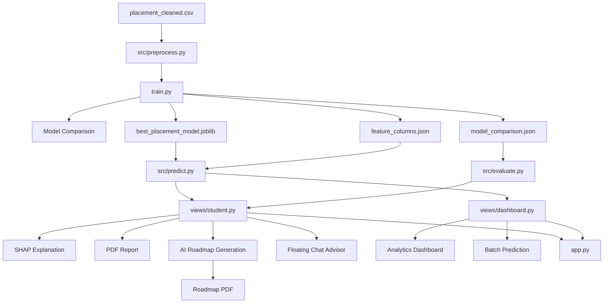

# Placement Prediction System - Complete Codebase Explanation Report

## 1. Introduction

This repository implements a small end-to-end machine learning product for engineering college placement prediction.

It has two major operating modes:

1. Offline training mode
   - Reads a cleaned CSV dataset
   - Encodes categorical features
   - Splits train and test data
   - Applies SMOTE on the training split
   - Evaluates multiple classifiers
   - Selects the best model by weighted F1 score
   - Saves the trained model and metadata artifacts

2. Online application mode
   - Loads the saved model and feature schema
   - Accepts a single student's profile through a Streamlit UI
   - Predicts placement probability and binary outcome
   - Computes a local SHAP explanation
   - Generates a human-readable PDF report
   - Optionally generates an AI roadmap and roadmap PDF
   - Offers a T&P dashboard for analytics and batch predictions

At the architectural level, the codebase is split into:

- `app.py` for Streamlit bootstrapping and page routing
- `views/` for UI pages
- `src/` for reusable ML, AI, and PDF logic
- `train.py` for artifact generation
- `data/` for training data
- `model/` for persisted artifacts

The project is not a layered enterprise application with database, API server, and background workers. It is a direct desktop-style Streamlit application whose business logic is imported in-process. That simplicity makes the runtime easy to follow.

## 2. Repository Inventory

### Root files

- `app.py`
  - Streamlit entry point
  - Page setup
  - Role selection
  - Floating chat render trigger

- `train.py`
  - Offline model training pipeline
  - Model comparison
  - Optional tuning for selected models
  - Artifact persistence

- `config.yaml`
  - Paths and training configuration

- `requirements.txt`
  - Python dependency lock-style list

- `README.md`
  - Short human-facing overview

- `CODEBASE_EXPLANATION_REPORT.md`
  - This report
>>>>>>> 904ed98 (....)

### 3.1 Folder Responsibilities

- `data/`
  Stores the cleaned CSV dataset used during model training.

- `model/`
  Stores model artifacts generated after training:
  - serialized best model,
  - saved feature column order,
  - evaluation metrics for all compared models.

- `src/`
  Contains reusable application logic such as preprocessing, prediction, evaluation, OpenAI integration, roadmap generation, and PDF generation.

- `views/`
  Contains Streamlit page-level UI logic.

- `app.py`
  Main Streamlit entry point and page router.

- `train.py`
  Offline model training pipeline.

---

## 4. Dataset Description

### 4.1 Dataset File

The project uses:

- `data/placement_cleaned.csv`

### 4.2 Dataset Size

From the current repository data file:

- Total rows: **200**
- Total columns: **14**

### 4.3 Raw Dataset Columns

The dataset contains the following columns:

1. `Student_ID`
2. `Name`
3. `Gender`
4. `Branch`
5. `10th_Percentage`
6. `12th_Percentage`
7. `BTech_CGPA`
8. `No_of_Projects`
9. `Internships`
10. `Technical_Skills_Count`
11. `Soft_Skills_Rating`
12. `Backlogs`
13. `Aptitude_Score`
14. `Placement_Status`

### 4.4 Target Variable

The target column is:
=======
- `data/placement_cleaned.csv`
  - Cleaned supervised learning dataset

- `model/best_placement_model.joblib`
  - Serialized trained classifier

- `model/feature_columns.json`
  - Ordered model input schema after one-hot encoding

- `model/model_comparison.json`
  - Stored metrics for all evaluated models

### Python packages

- `src/`
  - Core non-UI logic

- `views/`
  - Streamlit pages

- `__pycache__/`
  - Python bytecode cache

### Notebook folders

- `notebooks/`
- `model/Untitled.ipynb`

These do not participate in the main production flow shown by the application.

## 3. Actual Runtime Architecture

The architecture is best understood as two connected pipelines.

### 3.1 Training pipeline

`data/placement_cleaned.csv`
-> `src/preprocess.load_and_preprocess()`
-> encoded feature matrix + split data
-> `train.py` model evaluation loop
-> best model selection
-> optional hyperparameter tuning
-> save to `model/`

### 3.2 Application pipeline

User input in Streamlit
-> `views/student.show()`
-> `src.predict.predict_student()`
-> prediction probability + label
-> SHAP explanation inside `views/student.show()`
-> optional roadmap generation via `src.roadmap_gen.generate_roadmap()`
-> optional PDFs via `src.report_gen.generate_report()` and `src.roadmap_pdf.generate_roadmap_pdf()`

### 3.3 Dashboard pipeline

Uploaded CSV
-> `views/dashboard.show()`
-> analytics charts and metrics
or
-> row-by-row calls into `src.predict.predict_student()`
-> downloadable batch prediction CSV

## 4. Current Dataset and Artifact Facts

These are not assumptions. They come from the files currently in the repository.

### Dataset shape

- Rows: `200`
- Columns: `14`

### Dataset columns
>>>>>>> 904ed98 (....)

- `Placement_Status`


This is a binary output:

- `1` means the student is placed
- `0` means the student is not placed

### 4.5 Class Distribution

The current dataset distribution is:

- Placed (`1`): **142**
- Not placed (`0`): **58**

This shows a class imbalance in favor of placed students. The code addresses this imbalance using **SMOTE** during training.

### 4.6 Categorical Distribution

Current category distribution in the dataset:

- Gender:
  - Male: 124
  - Female: 76

- Branch:
  - CSE: 38
  - ME: 37
  - CE: 34
  - EEE: 32
  - IT: 30
  - ECE: 29

---

## 5. Configuration Layer

### 5.1 `config.yaml`

The configuration file centralizes important constants:

```yaml
paths:
  data: "data/placement_cleaned.csv"
  model: "model/best_placement_model.joblib"
  features: "model/feature_columns.json"
  comparison: "model/model_comparison.json"

model:
  target_column: "Placement_Status"
  drop_columns: ["Student_ID", "Name"]
  test_size: 0.2
  random_state: 42
  smote_random_state: 42

app:AI-Powered Student Placement Intelligence Platform
  title: ""
  placement_threshold: 0.5
```

### 5.2 Meaning of Configuration Entries

- `paths.data`
  Path of the training dataset.

- `paths.model`
  Path where the final trained model should be saved.

- `paths.features`
  Path where the ordered list of engineered feature columns is stored.

- `paths.comparison`
  Path where model comparison results are stored as JSON.

- `model.target_column`
  Column to be predicted.

- `model.drop_columns`
  Non-predictive identifier columns removed before training.

- `model.test_size`
  Fraction of the dataset reserved for testing.

- `model.random_state`
  Ensures reproducibility of train/test split and some models.

- `model.smote_random_state`
  Ensures reproducibility of SMOTE oversampling.

- `app.placement_threshold`
  Conceptually represents a probability threshold for class labeling, though in the current implementation the prediction label comes directly from `model.predict()` rather than this config value.

---

## 6. High-Level System Architecture

The codebase can be understood as five cooperating layers.

### 6.1 Architecture Layers

1. **Data Layer**
   - CSV dataset in `data/`
   - saved artifacts in `model/`

2. **Preprocessing and ML Layer**
   - feature engineering,
   - train/test split,
   - SMOTE balancing,
   - model training and evaluation.

3. **Inference Layer**
   - artifact loading,
   - input alignment,
   - single-student and batch prediction.

4. **Presentation Layer**
   - Streamlit student page,
   - Streamlit dashboard page,
   - charts, controls, downloads.

5. **AI and Reporting Layer**
   - SHAP explainability,
   - Azure OpenAI roadmap generation,
   - floating placement chatbot,
   - PDF generation.

### 6.2 Architecture Flow Diagram



---

## 7. End-to-End Execution Flow

### 7.1 Offline Training Flow

The training flow starts when:

```bash
python train.py
```

The steps are:

1. `train.py` calls `load_and_preprocess()` from `src/preprocess.py`.
2. The dataset is loaded from `data/placement_cleaned.csv`.
3. Identifier columns `Student_ID` and `Name` are dropped.
4. Features and target are separated.
5. Categorical columns are one-hot encoded using `pd.get_dummies(..., drop_first=True)`.
6. Data is split into training and test sets using stratified sampling.
7. SMOTE is applied **only on the training set** to balance the classes.
8. Six ML models are trained and evaluated.
9. Metrics such as accuracy, precision, recall, F1, ROC-AUC, and 5-fold CV accuracy are computed.
10. The best model is chosen based on **highest weighted F1 score**.
11. Optional hyperparameter tuning is applied for Random Forest or XGBoost only.
12. Final artifacts are saved to the `model/` folder.

### 7.2 App Startup Flow

When the application is launched with:

```bash
streamlit run app.py
```

the flow is:

1. `app.py` sets page configuration and injects global CSS.
2. It imports `views.student` and `views.dashboard`.
3. The sidebar radio decides which page to render.
4. The selected page’s `show()` function is called.
5. If a student prediction exists in session state, the floating advisor chat is rendered on top of the student page.

### 7.3 Student Prediction Flow

The student page follows this sequence:

1. Student enters profile data through form controls.
2. Skills are selected from predefined and custom options.
3. A `student_dict` is created.
4. `predict_student()` converts that dictionary into model-ready features.
5. The saved model generates:
   - placement probability,
   - placement class label.
6. The result is stored in `st.session_state`.
7. The page then:
   - computes SHAP explanation,
   - shows a gauge chart,
   - shows a radar chart,
   - lists top SHAP factors,
   - displays personalized recommendations,
   - allows roadmap generation,
   - and enables PDF downloads.

### 7.4 Dashboard Flow

The T&P dashboard has two modes:

- **Upload & Analyze**
  Used for descriptive analytics on a CSV dataset.

- **Batch Prediction**
  Used to run model predictions on many students and download the results.

### 7.5 AI Roadmap Flow

When the user clicks **Generate My Placement Roadmap**:

1. Top SHAP features are converted into a compact list of influential factors.
2. Selected skills are used to detect the student’s likely target field.
3. `src/roadmap_gen.py` builds a prompt.
4. Azure OpenAI is called through `src/advisor.py`.
5. The model returns a JSON roadmap.
6. The roadmap is shown inside the UI.
7. `src/roadmap_pdf.py` can convert that roadmap into a styled PDF.

---

## 8. Training Pipeline in Detail

### 8.1 `train.py`

This is the central training script. It orchestrates model creation, model evaluation, model selection, optional tuning, and artifact saving.

### Functions in `train.py`

#### `get_models()`

Returns a dictionary of candidate models:

- Logistic Regression
- Random Forest
- XGBoost
- Gradient Boosting
- SVM
- KNN

This provides a multi-model experimentation setup rather than assuming one model from the start.

#### `evaluate_all_models(models, X_train, X_test, y_train, y_test)`

This function:

- trains each model,
- predicts on the test set,
- computes predicted probabilities,
- evaluates performance,
- runs 5-fold cross-validation on training data,
- stores each model’s metrics in a list,
- and stores the fitted models in a dictionary.

Metrics computed:

- accuracy
- precision
- recall
- F1 score
- ROC-AUC
- CV mean accuracy
- CV standard deviation

This is the core experimental comparison step of the project.

#### `tune_best_model(fitted_models, results, X_train, y_train)`

This function:

1. finds the best model by maximum F1 score,
2. checks whether the model is Random Forest or XGBoost,
3. if yes, runs `RandomizedSearchCV`,
4. if not, skips tuning and returns the already fitted best model.

Important current behavior:

- The best model in the saved comparison results is **Logistic Regression** by weighted F1.
- Because tuning logic is implemented only for Random Forest and XGBoost, the best model is returned without additional hyperparameter search in the current artifact set.

#### `save_artifacts(model, feature_cols, results)`

This function writes:

- `best_placement_model.joblib`
- `feature_columns.json`
- `model_comparison.json`

These files are what make the app runnable after training.

### Main Execution Block

The `if __name__ == "__main__":` section:

- configures logging,
- starts preprocessing,
- evaluates all models,
- tunes the selected best model if applicable,
- saves artifacts,
- prints completion instructions.

---

## 9. Preprocessing Pipeline

### 9.1 `src/preprocess.py`

This file is responsible for loading project configuration and preparing the dataset for training.

### `load_config()`

Purpose:

- reads `config.yaml`,
- parses it using `yaml.safe_load`,
- returns a Python dictionary.

Why it matters:

- prevents hardcoding of key preprocessing values inside the pipeline.

### `load_and_preprocess()`

This is one of the most important functions in the project.

It performs the following operations:

1. loads config values,
2. reads the CSV dataset,
3. drops `Student_ID` and `Name`,
4. splits the dataframe into `X` and `y`,
5. performs one-hot encoding,
6. saves the encoded feature names,
7. performs train/test split using stratification,
8. applies SMOTE only to the training subset,
9. returns processed training data, test data, target vectors, and feature column names.

### Why `drop_first=True` is Important

`pd.get_dummies(..., drop_first=True)` avoids full dummy-variable redundancy by dropping one category from each categorical group.

In the current trained feature schema, the saved columns are:

- `Gender_Male`
- `Branch_CSE`
- `Branch_ECE`
- `Branch_EEE`
- `Branch_IT`
- `Branch_ME`

This means the omitted branch category acts as the baseline category. Given the branch values present in the dataset and UI, that implicit baseline is effectively **CE**.

### Why SMOTE is Used

The original dataset is imbalanced:

- 142 placed
- 58 not placed

If the model were trained directly on this data, it could become biased toward predicting the majority class. SMOTE synthetically generates minority-class training examples to improve balance and help the model learn the "not placed" class more effectively.

### Strength of the Implementation

A good design choice here is that SMOTE is applied only to `X_train` and `y_train`, not to the test set. That preserves fair evaluation.

---

## 10. Model Comparison and Evaluation

### 10.1 Models Compared

The project evaluates six algorithms:

1. Logistic Regression
2. Random Forest
3. XGBoost
4. Gradient Boosting
5. SVM
6. KNN

This is useful in a project report because it shows that model selection was empirical rather than arbitrary.

### 10.2 Saved Evaluation Results

The repository already contains `model/model_comparison.json` with these values:

| Model | Accuracy | Precision | Recall | F1 | ROC-AUC | CV Mean |
| --- | ---: | ---: | ---: | ---: | ---: | ---: |
| Logistic Regression | 0.8250 | 0.8204 | 0.8250 | 0.8169 | 0.8423 | 0.8381 |
| Random Forest | 0.8250 | 0.8299 | 0.8250 | 0.8091 | 0.8542 | 0.8600 |
| XGBoost | 0.7750 | 0.7645 | 0.7750 | 0.7646 | 0.8095 | 0.8294 |
| Gradient Boosting | 0.8000 | 0.8000 | 0.8000 | 0.8000 | 0.8452 | 0.8509 |
| SVM | 0.6250 | 0.6714 | 0.6250 | 0.6389 | 0.3125 | 0.6129 |
| KNN | 0.5500 | 0.6091 | 0.5500 | 0.5680 | 0.5729 | 0.8074 |

### 10.3 Selected Best Model

The project chooses the best model using **highest weighted F1 score**.

Based on the saved artifacts, the selected model is:

- **Logistic Regression**

### Why F1 Score Was a Good Choice

Because the dataset is imbalanced, F1 score is often more informative than accuracy alone. Accuracy could look high even if the model performs poorly on the minority class. F1 better balances precision and recall.

### Important Interpretation

- Logistic Regression gives the best F1.
- Random Forest gives the best ROC-AUC and CV mean accuracy.

This means the final model was not chosen because it was best in every metric, but because it best satisfied the project’s chosen selection criterion.

---

## 11. Inference Pipeline

### 11.1 `src/predict.py`

This file handles inference-time artifact loading and single-student prediction.

### `load_artifacts()`

Loads:

- the serialized model using `joblib.load`,
- the ordered feature column list using JSON.

Why this matters:

- the model alone is not enough,
- the app must also know the exact training-time feature order.

### `predict_student(student_dict, model, feature_cols)`

This function transforms live user input into the same format used during training.

Steps:

1. Convert the input dictionary into a one-row DataFrame.
2. Apply one-hot encoding with `pd.get_dummies`.
3. Add any missing training columns with value `0`.
4. Reorder columns to match `feature_cols`.
5. Run `predict_proba()` to get placement probability.
6. Run `predict()` to get the binary label.

Outputs:

- `prob`: probability of class 1
- `pred`: predicted class label

### Why Feature Alignment Is Critical

When one-hot encoding is performed on a single-row student input, many training columns may not appear naturally. Without column alignment, the model would receive the wrong shape or wrong ordering. The loop that fills missing columns with zero is therefore essential.

---

## 12. Evaluation Artifact Reader

### 12.1 `src/evaluate.py`

This file provides lightweight helpers for reading the model comparison artifact.

### `load_comparison_results()`

Reads `model_comparison.json`, converts it into a DataFrame, rounds numeric columns, and returns a clean table for display in Streamlit.

### `get_best_model_name(df)`

Returns the model name corresponding to the highest F1 score.

This module is mainly used for showing model performance in the UI rather than for training.

---

## 13. Streamlit Application Entry Point

### 13.1 `app.py`

This file is the runtime entry point of the web application.

### Responsibilities of `app.py`

- set Streamlit page configuration,
- inject global CSS for layout and floating chat behavior,
- display the application title,
- let the user choose between pages through a sidebar radio,
- route to `student.show()` or `dashboard.show()`,
- and render the floating advisor widget when a prediction exists.

### Page Routing Logic

The page router is simple:

- `Student Prediction` -> `views.student.show()`
- `T&P Dashboard` -> `views.dashboard.show()`

### Session-State Driven Overlay

If a prediction result exists in `st.session_state["latest_prediction"]`, the student page’s floating chat advisor is rendered with context such as:

- `student_dict`
- `prob`
- `skills`
- `pred`

This is how the chat widget becomes aware of the latest student profile.

---

## 14. Student Prediction Page

### 14.1 `views/student.py`

This is the largest file in the repository and the most feature-rich part of the project. It acts as the main user-facing orchestration layer for:

- manual student input,
- model prediction,
- SHAP explanation,
- charts,
- recommendations,
- AI roadmap generation,
- PDF downloads,
- and floating advisor chat.

### 14.2 Module-Level Initialization

At import time, this file loads:

- the trained model and feature columns via `load_artifacts()`,
- the model comparison table via `load_comparison_results()`.

This design keeps later UI actions fast because artifacts are already available.

### 14.3 Important Constants

#### `FEATURE_LABELS`

Maps internal feature names to readable display labels for UI and SHAP explanation.

Examples:

- `BTech_CGPA` -> `B.Tech CGPA`
- `No_of_Projects` -> `No. of Projects`
- `Gender_Male` -> `Gender (Male)`

#### `SKILL_OPTIONS`

A long predefined skill list used for the multiselect input. It includes skills across:

- programming,
- web development,
- AI/ML,
- cloud,
- databases,
- mobile,
- cybersecurity,
- CAD,
- DSA,
- and more.

This list is especially useful for roadmap generation, because selected skills are later used to infer the student’s probable target field.

### 14.4 Helper Functions

#### `_escape_html(value)`

Escapes text to safe HTML entities before injecting custom markup into Streamlit.

#### `_render_shap_inline_table(shap_df)`

Displays the top SHAP values as an inline bar-table.

It:

- picks top features,
- normalizes absolute SHAP values,
- assigns positive or negative styles,
- renders a compact HTML layout.

#### `render_floating_chat(student_dict, prob, skills, pred)`

This function builds a fully custom floating chat widget using `streamlit.components.v1.html`.

It:

- constructs a system prompt containing the student’s exact profile,
- injects Azure OpenAI endpoint and key details,
- creates a front-end chat UI in HTML/CSS/JavaScript,
- makes direct browser-side API calls to Azure OpenAI chat completions,
- formats AI responses with bold text, bullets, and numbered sections.

This is a major AI feature of the project because it turns the prediction result into a conversational guidance tool.

### 14.5 `show()`

This is the main page-rendering function.

It performs the following blocks of work.

#### Block 1: Page Styling and Header

Custom CSS is added to:

- reduce default Streamlit padding,
- format section cards,
- style the SHAP table,
- float the custom chat iframe above the app viewport.

#### Block 2: Model Information Panel

The user can expand a section showing model comparison metrics. The active model is derived from the highest F1 score in `comparison_df`.

#### Block 3: Input Form

The page collects:

- 10th percentage,
- 12th percentage,
- BTech CGPA,
- number of projects,
- internships,
- technical skills,
- soft skills rating,
- aptitude score,
- backlogs,
- gender,
- branch.

This matches the trained feature space used by the model.

#### Block 4: Student Skill Handling

The page stores selected skills in session state and supports:

- multiselect from a predefined list,
- optional custom skill input,
- automatic calculation of `Technical_Skills_Count`.

#### Block 5: Prediction Trigger

When the user clicks **Predict Placement**:

- a `student_dict` is created,
- `predict_student()` is called,
- probability and label are stored in session state.

#### Block 6: SHAP Explanation

If a prediction is present, the code attempts to generate SHAP explanations.

Current SHAP workflow:

1. rebuild one-row student dataframe,
2. align columns with training features,
3. reload preprocessed training data using `load_and_preprocess()`,
4. create a background dataset from `X_train`,
5. sample up to 50 background rows using `shap.sample`,
6. create a `shap.KernelExplainer`,
7. compute SHAP values with `nsamples=100`,
8. build a ranked dataframe of top features.

The code then identifies a **key risk factor** by choosing the most negative SHAP value.

#### Block 7: Result Visualizations

The page displays:

- a result metric card,
- probability metric,
- key risk factor metric,
- a Plotly gauge chart for probability,
- and a Plotly radar chart summarizing student strengths.

#### Block 8: Personalized Placement Roadmap

When the user clicks **Generate My Placement Roadmap**:

- SHAP factors are transformed into a simple list,
- `generate_roadmap()` is called,
- the AI-generated roadmap is stored in session state,
- roadmap phases, companies, skills, and quick wins are displayed,
- roadmap PDF becomes downloadable.

#### Block 9: PDF Downloads

The page allows the user to download:

- a standard placement report PDF from `src/report_gen.py`,
- a longer roadmap PDF from `src/roadmap_pdf.py`.

#### Block 10: Rule-Based Recommendations

Independent of the generative roadmap, the page also provides hand-written recommendations such as:

- clear backlogs,
- improve CGPA,
- do more projects,
- add technical skills,
- complete internships,
- practice aptitude.

This is useful because it ensures the user gets actionable feedback even if AI generation is unavailable.

---

## 15. SHAP Explainability Design

SHAP is one of the strongest technical components of the project because it converts a raw model prediction into an interpretable explanation.

### 15.1 Why SHAP is Used

A probability alone is not sufficient in many educational decision-support systems. SHAP helps answer:

- which features increased the placement probability,
- which features decreased it,
- and which factor is currently the biggest risk.

### 15.2 How SHAP Is Implemented

The project uses:

- `shap.KernelExplainer`

with:

- model function: `model.predict_proba`
- background sample: `shap.sample(background, 50)`
- explanation budget: `nsamples=100`

### 15.3 Output Produced

The code turns SHAP output into a dataframe with:

- `Feature`
- `SHAP Value`
- `Impact`

Then it sorts by absolute contribution and displays the most influential features.

### 15.4 Why This Matters in a Project Report

This makes the system more than a black-box classifier. It becomes an **explainable AI application**, which is important in academic projects because it improves interpretability, trust, and decision usefulness.

---

## 16. T&P Dashboard Page

### 16.1 `views/dashboard.py`

This page is designed for placement officers or administrators rather than individual students.

### Module-Level Initialization

The file loads the trained model and feature columns at import time.

### Main Function: `show()`

This function builds the dashboard with two tabs.

### Tab 1: `Upload & Analyze`

This tab provides descriptive analytics for an uploaded CSV.

Features include:

- dataset preview,
- total student count,
- number placed,
- number not placed,
- placement rate metric,
- pie chart for placement ratio,
- histogram for placement by branch,
- box plot for CGPA by placement,
- box plot for projects by placement,
- correlation heatmap for numeric columns,
- at-risk student table if identifiers are available.

This tab is primarily for diagnostic and exploratory analysis.

### Tab 2: `Batch Prediction`

This tab performs bulk inference on a user-uploaded CSV.

Process:

1. user uploads a CSV,
2. expected columns are validated,
3. the app loops through each row,
4. each row is converted into a `student_dict`,
5. `predict_student()` is called per row,
6. results are appended to the dataframe,
7. summary metrics are displayed,
8. the output CSV becomes downloadable.

Output columns added:

- `Placement_Prediction`
- `Placement_Probability_%`
- `Result`

### Significance

This turns the project from an individual prediction tool into an institutional analytics tool.

---

## 17. PDF Report Generation

### 17.1 `src/report_gen.py`

This file generates the standard student placement PDF report using `fpdf2`.

### Important Elements

#### `REPORT_FEATURE_LABELS`

Provides readable names for features used in SHAP output.

#### `_latin1_safe(text)`

Converts text safely into Latin-1-compatible characters because `fpdf` can otherwise fail on unsupported Unicode.

#### `PlacementReport(FPDF)`

Custom PDF class containing:

- `header()`
  renders title and subtitle,
- `footer()`
  renders page number and generation date.

#### `generate_report(student_dict, prob, pred, shap_df)`

Builds the full PDF and returns it as bytes.

The generated report contains:

1. prediction result summary,
2. placement probability,
3. student academic profile table,
4. SHAP-based factor table,
5. personalized recommendations.

This PDF is useful for offline sharing and formal reporting.

---

## 18. AI Roadmap Generation

### 18.1 `src/advisor.py`

This file wraps Azure OpenAI integration.

### `get_azure_client()`

Loads Azure endpoint, API key, and API version from:

- `st.secrets`
- or environment variables loaded from `.env`

If credentials are missing, it raises an informative error.

### `get_deployment_name()`

Fetches the Azure OpenAI deployment name.

### `chat_complete(messages, temperature=0.7, max_completion_tokens=1000)`

Sends a chat completion request and returns the resulting string content.

This is the reusable API wrapper used by roadmap generation.

### 18.2 `src/roadmap_gen.py`

This file is the main generative-AI planning engine.

### `FIELD_RESOURCES`

This is a major design element. It is a hardcoded knowledge base containing curated resources for many career tracks such as:

- AI/ML & Data Science
- Web Development (Full Stack)
- Cloud & DevOps
- Cybersecurity
- Software Engineering (General)
- Mobile Development
- Data Engineering & Databases
- Embedded & IoT
- Mechanical/Civil CAD
- Competitive Programming & Product

For each field, the code stores:

- learning paths,
- practice resources,
- target companies,
- certifications,
- GitHub project ideas,
- interview preparation areas.

This means the LLM is not operating without structure. It is guided by domain-specific resource scaffolding.

### `detect_field(skills)`

Infers the most likely target field based on skill keywords. For example:

- ML-related skills map to `AI/ML & Data Science`
- React or Node.js map to `Web Development (Full Stack)`
- AWS or Docker map to `Cloud & DevOps`

If no strong match exists, it defaults to:

- `Software Engineering (General)`

### `extract_json(text)`

Attempts to parse the model output into JSON.

It handles:

- raw JSON,
- JSON wrapped inside Markdown code blocks,
- JSON extracted from mixed text via regex.

### `_fallback_roadmap()`

Returns a safe minimal roadmap structure if AI generation fails.

### `generate_roadmap(student_dict, shap_factors, prediction_prob, skills=None)`

This is the main roadmap function.

It:

1. detects the field from the supplied skills,
2. chooses field-specific resources,
3. formats SHAP factors and student profile,
4. builds a strong system prompt and user prompt,
5. asks Azure OpenAI to return JSON only,
6. retries once if parsing fails,
7. returns either parsed roadmap JSON or fallback content.

### Output Structure

The roadmap JSON contains:

- `detected_field`
- `summary`
- `probability_context`
- `phases`
- `quick_wins`
- `companies_to_target`
- `skills_to_learn`
- `certifications`
- `project_ideas`
- `interview_prep`

### Why This AI Design Is Strong

This part of the project does not use AI just for decoration. It combines:

- model prediction probability,
- SHAP factor analysis,
- student skills,
- curated field knowledge,
- and structured JSON output.

That makes the generative feature grounded in the prediction context.

---

## 19. Roadmap PDF Generation

### 19.1 `src/roadmap_pdf.py`

This file converts AI roadmap JSON into a well-designed PDF.

### Design Role

Compared to the simpler report PDF, this file is visually richer. It includes:

- custom color palette,
- section title styling,
- phase cards,
- chips for companies,
- info boxes,
- two-column lists,
- custom footer.

### Important Functions

#### `_s(text)`

Sanitizes text into Latin-1-safe output for PDF rendering.

#### `RoadmapPDF(FPDF)`

Custom PDF class with an overridden footer.

#### `_draw_header(pdf, student_name, field, today_str)`

Draws the title block and field badge at the top of the roadmap.

#### `_section_title(pdf, text, icon_char, color)`

Creates section headings with color accents.

#### `_body(pdf, text, color=None)`

Renders regular paragraph text.

#### `_bullet(pdf, text, color=None, symbol="->")`

Renders bullet-style items.

#### `_numbered(pdf, num, text, num_color=None)`

Renders numbered action items.

#### `_phase_card(pdf, phase, idx)`

Displays one roadmap phase as a styled card.

#### `_chips(pdf, items, bg_color, text_color=WHITE)`

Renders company names and similar short items as chips.

#### `_info_box(pdf, text, bg, border_color)`

Draws a shaded paragraph box.

#### `_two_col_list(pdf, items, color)`

Renders lists like skills or interview areas in two columns.

#### `generate_roadmap_pdf(student_name, roadmap)`

Main entry function that assembles all sections into the final roadmap PDF and returns bytes.

---

## 20. AI Chatbot Component

The floating placement advisor is a separate AI capability from roadmap generation.

### 20.1 What It Does

It gives conversational advice tailored to the student’s:

- branch,
- CGPA,
- scores,
- projects,
- internships,
- backlog count,
- technical skills,
- placement probability,
- and prediction label.

### 20.2 How It Works

Inside `render_floating_chat()`:

1. profile context is embedded into a detailed system prompt,
2. HTML/CSS/JavaScript are generated,
3. the widget appears as a floating panel,
4. JavaScript sends direct requests to Azure OpenAI chat completions,
5. responses are shown in a formatted chat UI.

### 20.3 Why It Matters

This makes the application more interactive and student-centric. Instead of a one-time prediction, the user can continue asking:

- what to improve,
- what companies to target,
- how to prepare,
- what roadmap to follow,
- or how to increase placement probability.

### 20.4 Important Implementation Note

In the current implementation, the advisor chat is browser-side and is rendered through a custom HTML component. Conceptually, this acts like an embedded front-end micro-app inside the Streamlit app.

---

## 21. Saved Artifacts and Their Roles

The `model/` folder stores runtime-critical artifacts.

### 21.1 `best_placement_model.joblib`

Contains the serialized trained classifier used during inference.

### 21.2 `feature_columns.json`

Contains the exact training-time feature order:
=======
### Target distribution

- `Placement_Status = 1`: `142`
- `Placement_Status = 0`: `58`

This is why SMOTE is used during training: the classes are imbalanced.

### Branch distribution

- `CSE`: `38`
- `ME`: `37`
- `CE`: `34`
- `EEE`: `32`
- `IT`: `30`
- `ECE`: `29`

### Gender distribution

- `Male`: `124`
- `Female`: `76`

### Saved feature schema

The trained model expects exactly these `15` input features:
>>>>>>> 904ed98 (....)

- `10th_Percentage`
- `12th_Percentage`
- `BTech_CGPA`
- `No_of_Projects`
- `Internships`
- `Technical_Skills_Count`
- `Soft_Skills_Rating`
- `Backlogs`
- `Aptitude_Score`
- `Gender_Male`
- `Branch_CSE`
- `Branch_ECE`
- `Branch_EEE`
- `Branch_IT`
- `Branch_ME`

### 21.3 `model_comparison.json`


Contains evaluation scores for all candidate models and allows the UI to show transparent model-comparison information.

---

## 22. Tech Stack Explanation

This project uses a layered technology stack.

### 22.1 Programming Language

- **Python**

Python is used because it is strong for data science, machine learning, rapid prototyping, and building educational analytics systems.

### 22.2 Front-End / App Layer

- **Streamlit**

Used for:

- quick web app development,
- input forms,
- charts,
- file uploads,
- session state,
- download buttons.

### 22.3 Data Processing

- **pandas**
  Used for CSV loading, tabular transformation, and DataFrame operations.

- **PyYAML**
  Used for configuration parsing.

### 22.4 Machine Learning

- **scikit-learn**
  Used for:
  - train/test split,
  - evaluation metrics,
  - cross-validation,
  - Logistic Regression,
  - Random Forest,
  - Gradient Boosting,
  - SVM,
  - KNN,
  - RandomizedSearchCV.

- **xgboost**
  Used for boosted tree classification.

- **imbalanced-learn**
  Used for SMOTE oversampling.

- **joblib**
  Used for model serialization.

### 22.5 Explainable AI

- **SHAP**
  Used to explain how input features affect predictions.

### 22.6 Visualization

- **Plotly**
  Used for:
  - gauge chart,
  - radar chart,
  - pie chart,
  - histogram,
  - box plots,
  - heatmaps.

### 22.7 PDF Reporting

- **fpdf2**
  Used to generate both:
  - placement report PDFs,
  - roadmap PDFs.

### 22.8 Generative AI

- **OpenAI Python SDK**
  Used with **Azure OpenAI** credentials and deployment details.

- **python-dotenv**
  Used to load local `.env` values.

### 22.9 Additional Installed Dependencies

The `requirements.txt` file also includes packages such as:

- `SQLAlchemy`
- `psycopg2-binary`
- `openpyxl`
- `seaborn`

These are not central to the currently active code path, but may have been included for experimentation, future extension, or environment completeness.

---

## 23. Function-by-Function Summary

This section gives a concise code-level summary of the important functions in the repository.

### `src/preprocess.py`

- `load_config()`
  Loads YAML configuration.

- `load_and_preprocess()`
  Reads data, drops unused columns, encodes categoricals, splits train/test data, applies SMOTE, and returns processed arrays.

### `src/predict.py`

- `load_artifacts()`
  Loads the trained model and saved feature schema.

- `predict_student(student_dict, model, feature_cols)`
  Converts student input into aligned features and returns prediction probability and label.

### `src/evaluate.py`

- `load_comparison_results()`
  Loads the model comparison JSON as a DataFrame.

- `get_best_model_name(df)`
  Finds the model with the highest F1.

### `src/advisor.py`

- `get_azure_client()`
  Initializes Azure OpenAI client.

- `get_deployment_name()`
  Gets deployment name from secrets or env.

- `chat_complete(messages, temperature, max_completion_tokens)`
  Sends prompt messages and returns generated text.

### `src/roadmap_gen.py`

- `_build_user_prompt(...)`
  A helper prompt builder that is currently not the main prompt path used by `generate_roadmap()`.

- `_fallback_roadmap()`
  Returns default fallback roadmap content.

- `detect_field(skills)`
  Maps skills to a career field.

- `extract_json(text)`
  Parses JSON from model output.

- `generate_roadmap(...)`
  Builds the prompt, calls the LLM, retries if needed, and returns roadmap JSON.

### `src/report_gen.py`
=======
- `Gender_Female` is the dropped baseline category
- `Branch_CE` is the dropped baseline category because `pd.get_dummies(..., drop_first=True)` was used

### Saved active model

The persisted model in `model/best_placement_model.joblib` is currently:

- `LogisticRegression(max_iter=1000, random_state=42)`

### Stored comparison results

The saved comparison file shows:

- Logistic Regression: best weighted F1
- Random Forest: tied or comparable accuracy, higher ROC-AUC than logistic regression
- XGBoost, Gradient Boosting, SVM, KNN also evaluated

The application currently treats Logistic Regression as the deployed model because that is the object saved in `best_placement_model.joblib`.

## 5. File-by-File Explanation

## 5.1 `app.py`

Purpose:

- Initializes Streamlit
- Injects global CSS
- Routes between student and dashboard pages
- Renders the floating AI chat only after a student prediction exists

How it works:

1. `st.set_page_config(...)` sets page title and wide layout.
2. A large CSS block customizes top padding and fixes the custom component iframe so the chatbot behaves like a floating overlay.
3. A styled title is rendered via `st.markdown(...)`.
4. A sidebar radio decides between:
   - `Student Prediction`
   - `T&P Dashboard`
5. Depending on selection:
   - `student.show()` is called
   - or `dashboard.show()` is called
6. After the student page renders, if `st.session_state["latest_prediction"]` exists, `student.render_floating_chat(...)` is called with the latest prediction context.

Architectural role:

- This is the root composition layer.
- It contains almost no business logic.
- It wires pages together and coordinates cross-page UI behavior.

## 5.2 `train.py`

Purpose:

- Trains candidate models
- Evaluates them
- Selects the best one
- Optionally tunes it
- Saves output artifacts

### Key constants

The file defines model paths and some local constants:

- `DATA_PATH`
- `MODEL_DIR`
- `MODEL_PATH`
- `FEATURE_PATH`
- `COMPARISON_PATH`

However, note that training does not actually use `DATA_PATH`, `TARGET_COLUMN`, `DROP_COLUMNS`, or `RANDOM_STATE` directly for preprocessing. It delegates to `src.preprocess.load_and_preprocess()`, which reads `config.yaml`. So some constants in `train.py` are redundant.
>>>>>>> 904ed98 (....)

- `_latin1_safe(text)`
  Makes text safe for PDF rendering.

- `PlacementReport.header()`
  PDF title area.

- `PlacementReport.footer()`
  PDF footer with date and page number.

- `generate_report(student_dict, prob, pred, shap_df)`
  Builds the placement report PDF.

### `src/roadmap_pdf.py`

- `_s(text)`
  PDF-safe text sanitizer.

- `_draw_header(...)`
  Renders roadmap header.

- `_section_title(...)`
  Renders section heading.

- `_body(...)`
  Renders paragraph text.

- `_bullet(...)`
  Renders bullet item.

- `_numbered(...)`
  Renders numbered list item.

- `_phase_card(...)`
  Renders phase panel.

- `_chips(...)`
  Renders chip-like labels.

- `_info_box(...)`
  Renders shaded box.

- `_two_col_list(...)`
  Renders two-column list.

- `generate_roadmap_pdf(student_name, roadmap)`
  Produces the roadmap PDF.

### `views/student.py`

- `_escape_html(value)`
  Escapes HTML characters.

- `_render_shap_inline_table(shap_df)`
  Displays ranked SHAP factors.

- `render_floating_chat(student_dict, prob, skills, pred)`
  Renders the AI chat overlay.

- `show()`
  Main student page workflow.

### `views/dashboard.py`

- `show()`
  Main dashboard workflow for analytics and batch prediction.

### `train.py`

- `get_models()`
  Builds candidate model dictionary.

- `evaluate_all_models(...)`
  Trains and evaluates all models.

- `tune_best_model(...)`
  Tunes best model where supported.

- `save_artifacts(...)`
  Saves training outputs.

---

## 24. Strengths of the Codebase

This project has several strong academic and practical qualities.

### 24.1 End-to-End Completeness

The repository covers:

- data preprocessing,
- model training,
- model comparison,
- inference,
- explainability,
- dashboarding,
- reporting,
- and AI augmentation.

### 24.2 Good Separation of Concerns

The project cleanly separates:

- preprocessing logic,
- inference logic,
- evaluation logic,
- UI logic,
- AI roadmap logic,
- PDF generation logic.

### 24.3 Explainable AI Inclusion

Using SHAP significantly improves the project quality for an academic report because it adds interpretability rather than giving only raw predictions.

### 24.4 Multi-Role Design

Supporting both students and placement officers makes the system more realistic and institution-ready.

### 24.5 Artifact-Based Deployment

The app does not retrain every time it runs. Instead, it uses saved artifacts, which is how real ML applications are typically deployed.

### 24.6 Combination of Predictive AI and Generative AI

The project includes:

- **predictive AI** for classification,
- **explainable AI** for transparency,
- **generative AI** for personalized planning and chat advice.

This makes it more sophisticated than a basic ML mini-project.

---

## 25. Current Design Notes and Practical Limitations

For a strong project report, it is useful to honestly document the current implementation details.

### 25.1 Small Dataset Size

The current dataset has 200 rows, which is acceptable for a student project but relatively small for production-grade ML generalization.

### 25.2 SHAP Computation Cost

The student page computes SHAP explanations on demand using `KernelExplainer`, which can be computationally expensive compared to model-specific explainers.

### 25.3 Tuning Logic Scope

Hyperparameter tuning is implemented only for:
=======
Returns six model instances:
>>>>>>> 904ed98 (....)

- Random Forest
- XGBoost

If another model wins, tuning is skipped.

### 25.4 Configuration Use

`config.yaml` includes `placement_threshold`, but prediction labels are currently taken from the model’s own `predict()` method rather than manually thresholding `predict_proba()`.

### 25.5 Extra Dependencies

Some packages in `requirements.txt` are not actively used in the visible code path, which suggests the environment is broader than the minimum required runtime.

### 25.6 Browser-Side Chat Architecture

The floating chat widget is embedded as a custom HTML/JS component and performs client-side chat requests. Architecturally this is different from the roadmap generation, which goes through Python.

These are not necessarily flaws, but they are meaningful implementation details that can be discussed in a report.

---

## 26. Possible Future Enhancements

The current codebase is already substantial, but several improvements could be added later.

### 26.1 Model Improvements

- larger and more diverse dataset,
- feature scaling where needed,
- more systematic hyperparameter tuning,
- threshold optimization,
- calibration analysis,
- confusion matrix reporting.

### 26.2 MLOps Improvements

- pipeline versioning,
- experiment tracking,
- artifact version management,
- scheduled retraining,
- train/inference schema validation.

### 26.3 App Improvements

- student login,
- database integration,
- historical tracking of predictions,
- role-based access,
- department-wise dashboard filters,
- search and export by branch or risk level.

### 26.4 AI Improvements
=======
- Gradient Boosting
- SVM with probabilities enabled
- KNN

This function is the model registry for the experiment.

### `evaluate_all_models(...)`

Responsibilities:

- Fit each candidate model
- Predict on the test set
- Compute metrics
- Compute cross-validation accuracy on training data
- Collect fitted models and result metadata

For each model:

1. `.fit(X_train, y_train)`
2. `predict(X_test)` for class labels
3. `predict_proba(X_test)[:, 1]` for placement probabilities
4. Compute:
   - accuracy
   - weighted precision
   - weighted recall
   - weighted F1
   - ROC-AUC
   - 5-fold CV accuracy mean and std
5. Print classification report
6. Store the fitted model in a dictionary

Output:

- `results`: list of metric dictionaries
- `fitted_models`: mapping from model name to trained estimator

### `tune_best_model(...)`

Responsibilities:

- Select the best model by highest weighted F1
- Tune it only if it is Random Forest or XGBoost

Logic:

1. Find the max of `results` using `f1`
2. If best model is:
   - `Random Forest`: define RF hyperparameter grid
   - `XGBoost`: define XGBoost hyperparameter grid
   - anything else: skip tuning and return the fitted model directly
3. Run `RandomizedSearchCV` with:
   - `n_iter=20`
   - `cv=5`
   - `scoring="f1"`
   - `n_jobs=-1`
4. Return `search.best_estimator_`

Current behavior in this repository:

- Logistic Regression has the highest saved weighted F1
- Therefore tuning is skipped
- The already fitted Logistic Regression model is persisted as the production model

### `save_artifacts(...)`

Writes three files:

- joblib model
- feature column JSON
- model comparison JSON

This is the key boundary between offline training and online inference.


- retrieval-augmented resource recommendations,
- more grounded chat prompts,
- structured advisor responses,
- recommendation confidence levels,
- caching of roadmap generation.

---

## 27. Conclusion

This codebase is a well-rounded academic major-project implementation of a **Placement Prediction System**. It is not limited to a single ML model or a simple notebook-based experiment. Instead, it demonstrates the full workflow of a practical AI application:

- data preparation,
- balanced model training,
- multi-model evaluation,
- artifact persistence,
- interactive web deployment,
- explainable AI with SHAP,
- analytics dashboards,
- PDF report generation,
- and generative AI-based student guidance.

From a software architecture point of view, the project is modular, understandable, and easy to explain in a report. From an AI perspective, it is especially strong because it combines:
=======
Execution order:

1. Configure logging
2. Load and preprocess data
3. Build candidate models
4. Evaluate all models
5. Tune the best model if supported
6. Save artifacts

## 5.3 `src/preprocess.py`

Purpose:

- Centralized training-time preprocessing
>>>>>>> 904ed98 (....)

- **classification** for predicting placement,
- **explainability** for showing why,
- and **generation** for telling the student what to do next.

That combination makes the project suitable not only as a machine learning demonstration, but also as a complete decision-support system for students and placement teams.
=======
- Reads `config.yaml`
- Returns parsed YAML as Python dict

### `load_and_preprocess()`

This is the training data preparation pipeline.

Step-by-step:

1. Load config
2. Resolve `data_path`
3. Read CSV into a DataFrame
4. Drop configured identifier columns:
   - `Student_ID`
   - `Name`
5. Split into:
   - `X`: feature columns
   - `y`: `Placement_Status`
6. Apply one-hot encoding using `pd.get_dummies(X, drop_first=True)`
7. Store the resulting ordered feature column names
8. Split into train and test with:
   - `test_size = 0.2`
   - `random_state = 42`
   - `stratify = y`
9. Apply SMOTE only on the training split
10. Return:
   - `X_train_resampled`
   - `X_test`
   - `y_train_resampled`
   - `y_test`
   - `feature_cols`

Important architectural detail:

- The preprocessing logic used in training is not packaged as a scikit-learn pipeline object.
- Instead, training and inference manually repeat encoding logic.
- The feature schema is synchronized by saving `feature_columns.json`.

## 5.4 `src/predict.py`

Purpose:

- Runtime artifact loading
- Single-student inference

### `load_artifacts()`

Loads:

- `best_placement_model.joblib`
- `feature_columns.json`

Returns:

- `model`
- `feature_cols`

### `predict_student(student_dict, model, feature_cols)`

This is the inference adapter between UI input and the trained model.

Step-by-step:

1. Wrap the input dictionary in a one-row DataFrame
2. Apply `pd.get_dummies(..., drop_first=True)` to match training style
3. For every expected trained column missing in the input row, add it with zero
4. Reorder columns to exactly match `feature_cols`
5. Run:
   - `model.predict_proba(...)` to get probability
   - `model.predict(...)` to get binary class
6. Return `(prob, pred)`

Why this works:

- Since training saved the exact feature order, inference can reconstruct the same vector shape.
- Baseline categories are represented implicitly by missing dummy columns that are then filled with zero.

## 5.5 `src/evaluate.py`

Purpose:

- Load saved model comparison metrics for UI display

### `load_comparison_results()`

1. Read `model/model_comparison.json`
2. Convert it to a DataFrame
3. Round numeric columns to 4 decimals
4. Return the DataFrame

### `get_best_model_name(df)`

- Finds the row with max `f1`
- Returns its `model_name`

This module is used by the student page to explain which model family was selected during training.

## 5.6 `src/advisor.py`

Purpose:

- Azure OpenAI wrapper for server-side roadmap generation

### How it works

1. `load_dotenv(...)` loads `.env`
2. `get_azure_client()` reads:
   - `AZURE_OPENAI_MINI_ENDPOINT`
   - `AZURE_OPENAI_MINI_API_KEY`
   - `AZURE_OPENAI_MINI_API_VERSION`
3. If any are missing, it raises a `ValueError`
4. It instantiates `openai.AzureOpenAI`
5. `get_deployment_name()` reads `AZURE_OPENAI_MINI_DEPLOYMENT`
6. `chat_complete(...)` sends a chat completion request and returns the response text

Architectural role:

- This is the server-side LLM integration used by `src.roadmap_gen`.

## 5.7 `src/roadmap_gen.py`

Purpose:

- Turn a student's profile plus SHAP factors plus skills into a structured placement roadmap

This module is more than a thin LLM wrapper. It contains domain logic before prompting the model.

### `FIELD_RESOURCES`

This is a large static knowledge base mapping target placement fields to:

- learning resources
- practice ideas
- target companies
- certifications
- GitHub project ideas
- interview preparation topics

Supported fields include:

- AI/ML & Data Science
- Web Development (Full Stack)
- Cloud & DevOps
- Cybersecurity
- Software Engineering (General)
- Mobile Development
- Data Engineering & Databases
- Embedded & IoT
- Mechanical/Civil CAD
- Competitive Programming & Product

### `_fallback_roadmap()`

Returns a minimal empty roadmap when AI generation fails.

This is important because the UI can still continue rendering without crashing.

### `detect_field(skills)`

This function infers the student's likely target placement field using keyword matching over the selected skills list.

How it works:

1. Lowercase all skills
2. For each field, count keyword hits
3. Return the field with the highest score
4. If nothing matches, return `Software Engineering (General)`

This is deterministic heuristic classification, not ML.

### `extract_json(text)`

Robustness helper:

- Tries to parse JSON directly
- If the model wrapped JSON in code fences or extra text, it strips fences or extracts the first JSON-looking object with regex

### `generate_roadmap(...)`

This is the main roadmap generation flow.

Inputs:

- `student_dict`
- `shap_factors`
- `prediction_prob`
- optional `skills`

Execution flow:

1. Normalize `skills`
2. Infer target field via `detect_field`
3. Pull field-specific resource bundle from `FIELD_RESOURCES`
4. Build a compact SHAP summary using top five factors
5. Build a system prompt describing the advisor persona
6. Build a long user prompt containing:
   - academic details
   - profile metrics
   - target field
   - placement probability
   - SHAP factors
   - field-specific resource names
   - exact JSON schema to return
7. Send the request through `chat_complete(...)`
8. Parse the response as JSON
9. If parsing fails, retry once with a stricter message
10. If it still fails, return the fallback roadmap

Output shape:

- `detected_field`
- `summary`
- `probability_context`
- `phases`
- `quick_wins`
- `companies_to_target`
- `skills_to_learn`
- `certifications`
- `project_ideas`
- `interview_prep`

Architectural role:

- This module bridges ML explainability and generative AI guidance.
- It does not affect the prediction result itself.
- It is a post-prediction advisory subsystem.

## 5.8 `src/report_gen.py`

Purpose:

- Generate a classic PDF placement report for a single student

### Main pieces

- `REPORT_FEATURE_LABELS`
  - Human-readable labels for technical feature names

- `_latin1_safe(text)`
  - Sanitizes strings for FPDF compatibility

- `PlacementReport(FPDF)`
  - Custom header and footer

- `generate_report(student_dict, prob, pred, shap_df)`
  - Builds the full PDF

### PDF structure

1. Header
   - App title
   - Report title

2. Prediction Result section
   - Binary outcome banner
   - Probability text

3. Student Academic Profile section
   - Tabular summary of major inputs

4. SHAP Analysis section
   - Feature
   - SHAP value
   - Positive/Negative impact

5. Personalized Recommendations section
   - Rule-based recommendation bullets based on profile weaknesses

Important point:

- These recommendations are deterministic heuristics, not generated by the model or by AI.

## 5.9 `src/roadmap_pdf.py`

Purpose:

- Generate a visually richer PDF for the AI roadmap

This file is presentation-heavy. Its job is layout, color, typography, spacing, and section rendering.

### Structure

- Color palette constants
- Text sanitation helper `_s(...)`
- `RoadmapPDF(FPDF)` subclass with custom footer
- Multiple layout helpers:
  - `_draw_header`
  - `_section_title`
  - `_bullet`
  - `_numbered`
  - `_phase_card`
  - `_chips`
  - `_info_box`
  - `_two_col_list`
- `generate_roadmap_pdf(student_name, roadmap)`

### Output sections

- Header banner
- Placement assessment
- Probability context
- 6-month action plan
- Quick wins
- Companies to target
- Skills to build
- Certifications
- Project ideas
- Interview prep areas

Architectural role:

- Pure formatting layer for the roadmap JSON generated by `src/roadmap_gen`.

## 5.10 `views/student.py`

Purpose:

- Entire student-facing application workflow

This is the most complex file in the repository because it contains:

- form UI
- prediction trigger
- SHAP explanation generation
- metrics and charts
- AI roadmap UI
- PDF download buttons
- rule-based recommendations
- floating AI chatbot implementation

### Module-level initialization

At import time it executes:

- `model, feature_cols = load_artifacts()`
- `comparison_df = load_comparison_results()`

This means the model is loaded once when the page module is imported rather than on each prediction click.

### Helper data

- `FEATURE_LABELS`
  - Human-readable display labels for SHAP features

- `SKILL_OPTIONS`
  - Long hard-coded selectable skill list used by the roadmap and chatbot context

### `_render_shap_inline_table(shap_df)`

This helper converts SHAP output into a styled mini horizontal bar display rendered via HTML and CSS.

### `render_floating_chat(...)`

This is a self-contained chatbot rendered as a Streamlit HTML component.

Its behavior:

1. Reads Azure credentials directly from `.env`
2. Builds a student-aware system prompt containing:
   - branch
   - CGPA
   - 10th/12th scores
   - projects
   - internships
   - backlogs
   - selected skills
   - soft skills
   - aptitude
   - prediction result
   - probability
3. Constructs a large HTML string with:
   - floating button
   - chat panel
   - message area
   - text box
   - JavaScript formatting helpers
4. Creates a browser-side `fetch(...)` call to the Azure OpenAI endpoint
5. Maintains client-side conversation history in JavaScript

Architectural note:

- This chatbot does not go through the Python `src/advisor.py` wrapper.
- It calls Azure OpenAI directly from the browser.

### `show()`

This is the core student page renderer.

#### Step A: Page styling and header

- Injects CSS
- Renders page title and subtitle

#### Step B: Model info section

- Opens an expander describing the trained model comparison
- Displays metrics table from `comparison_df`
- Highlights the best model by F1

#### Step C: Input form

The page is split into 3 columns:

- Column 1:
  - 10th percentage
  - 12th percentage
  - CGPA
  - projects

- Column 2:
  - internships
  - multi-select skills
  - custom skill input
  - derived technical skill count
  - soft skills slider
  - aptitude slider

- Column 3:
  - backlogs
  - gender
  - branch
  - predict button

Important implementation detail:

- `Technical_Skills_Count` is derived from the number of selected plus custom skills
- If no skills are selected, it falls back to `1` rather than `0`

#### Step D: Prediction trigger

When the user clicks `Predict Placement`:

1. Old roadmap state is cleared
2. Selected skills are stored in `st.session_state["student_skills"]`
3. A `student_dict` is assembled
4. `predict_student(...)` is called
5. The result is saved into `st.session_state["latest_prediction"]`

Why session state is used:

- Streamlit reruns the script on interaction
- Session state preserves the latest prediction across reruns
- That allows the charts, PDF buttons, and chat widget to remain available

#### Step E: SHAP generation

If `latest_prediction` exists:

1. Rebuild the student input as one-hot encoded `sdf`
2. Re-run `load_and_preprocess()` to get training data
3. Use the training data as SHAP background
4. Construct `shap.KernelExplainer(model.predict_proba, shap.sample(background, 50))`
5. Compute `shap_values` with `nsamples=100`
6. Normalize the output depending on SHAP return shape
7. Build `shap_df`
8. Sort features by absolute SHAP magnitude
9. Keep top 10
10. Add positive/negative labels

This SHAP logic is local explanation only for the current prediction.

#### Step F: Prediction result display

Renders:

- metric cards
  - placement result
  - probability
  - key risk factor

- gauge chart
  - probability and threshold at 50%

- radar chart
  - 10th
  - 12th
  - CGPA
  - projects
  - technical skills
  - soft skills
  - aptitude

- SHAP explanation table

#### Step G: AI roadmap generation

On `Generate My Placement Roadmap`:

1. Convert `shap_df` into a simpler list of dictionaries
2. Call `generate_roadmap(...)`
3. Store roadmap JSON in session state
4. Render:
   - summary
   - probability context
   - up to 3 phase cards
   - quick wins
   - companies
   - skills to learn
5. Generate roadmap PDF and expose a download button

There is also backward compatibility logic:

- If `generate_roadmap(...)` does not accept the `skills` keyword, the code retries without it

That suggests the function signature changed at some point.

#### Step H: Report PDF

- Calls `src.report_gen.generate_report(...)`
- Exposes a download button

#### Step I: Rule-based recommendations

After the prediction, the page shows simple recommendations based on thresholds:

- backlogs > 0
- projects < 2
- CGPA < 7.0
- technical skills < 5
- internships == 0
- aptitude < 6
- strong profile case

These are deterministic and separate from the AI roadmap.

## 5.11 `views/dashboard.py`

Purpose:

- T&P analytics page
- Batch prediction page

### Module-level initialization

- `model, feature_cols = load_artifacts()`

Again, this loads the model once at import time.

### `show()`

The function wraps the whole page in a `try/except`, so UI errors are shown on-screen with traceback.

#### Tab 1: Upload & Analyze

Workflow:

1. User uploads a CSV
2. DataFrame is loaded and previewed
3. If `Placement_Status` exists, the page computes:
   - total students
   - placed count
   - not placed count
   - placement rate
4. It renders:
   - pie chart for placement ratio
   - branch histogram if branch exists
5. If `BTech_CGPA` and `Placement_Status` exist:
   - box plot by placement status
6. If `No_of_Projects` and `Placement_Status` exist:
   - projects box plot by placement status
7. If enough numeric columns exist:
   - correlation heatmap
8. If identifiers and `Placement_Status` exist:
   - at-risk table for non-placed students

Important point:

- This tab is descriptive analytics.
- It does not use the ML model unless the uploaded dataset already contains `Placement_Status`.
- It analyzes the uploaded data as-is.

#### Tab 2: Batch Prediction

Workflow:

1. User uploads a CSV
2. Preview is shown
3. User clicks `Run Batch Prediction`
4. File is validated against required columns
5. For each row:
   - build `student_dict`
   - call `predict_student(...)`
   - append probability and prediction
   - update progress bar
6. Final result adds:
   - `Placement_Prediction`
   - `Placement_Probability_%`
   - `Result`
7. Summary metrics are rendered
8. Full result table is shown
9. User can download predictions as CSV

Architectural note:

- Batch inference is implemented as a Python loop over rows
- It is simple and easy to understand
- It is not vectorized

## 5.12 `views/__init__.py` and `src/__init__.py`

These are package markers.

They do not add behavior.

## 6. End-to-End Flow Explanations

## 6.1 Full training flow

1. Developer runs:
   - `python train.py`
2. `train.py` calls `load_and_preprocess()`
3. Preprocessing:
   - reads config
   - loads CSV
   - drops `Student_ID` and `Name`
   - one-hot encodes `Gender` and `Branch`
   - train/test split
   - SMOTE on training data only
4. Six candidate models are trained and evaluated
5. The best model is selected by weighted F1
6. If the best model is RF or XGBoost, it is tuned with `RandomizedSearchCV`
7. Artifacts are saved in `model/`
8. The Streamlit app can now use those artifacts

## 6.2 Full student prediction flow

1. User opens app with:
   - `streamlit run app.py`
2. `app.py` imports `views.student`
3. `views.student` loads model and comparison artifacts
4. User enters profile data and clicks `Predict Placement`
5. A `student_dict` is assembled
6. `predict_student()`:
   - one-hot encodes the single row
   - aligns it to saved training columns
   - runs model prediction
7. Result is stored in session state
8. Same page reruns and sees `latest_prediction`
9. SHAP explanation is computed for the current row
10. UI renders:
   - metrics
   - probability gauge
   - radar chart
   - SHAP table
   - report download
   - recommendations
11. If user wants roadmap:
   - AI roadmap is generated
   - roadmap sections render
   - roadmap PDF download becomes available
12. If `latest_prediction` exists, `app.py` also renders the floating chat

## 6.3 Full dashboard analytics flow

1. User switches to `T&P Dashboard`
2. `dashboard.show()` renders two tabs
3. If analytics CSV is uploaded:
   - descriptive charts and tables appear
4. If batch CSV is uploaded and run:
   - each student row is scored
   - predictions are appended
   - result CSV can be downloaded

## 7. Configuration and Contracts

## 7.1 `config.yaml`

Current config:

- `paths.data`: `data/placement_cleaned.csv`
- `paths.model`: `model/best_placement_model.joblib`
- `paths.features`: `model/feature_columns.json`
- `paths.comparison`: `model/model_comparison.json`
- `model.target_column`: `Placement_Status`
- `model.drop_columns`: `["Student_ID", "Name"]`
- `model.test_size`: `0.2`
- `model.random_state`: `42`
- `model.smote_random_state`: `42`
- `app.title`: `Engineering College Placement Prediction System`
- `app.placement_threshold`: `0.5`

Important observation:

- `config.yaml` is used by preprocessing
- but not every runtime file reads all config values
- the app threshold in config is currently not consumed by the UI logic

## 7.2 Input contract for single-student prediction

`predict_student(...)` expects a dict with these keys:

- `Gender`
- `Branch`
- `10th_Percentage`
- `12th_Percentage`
- `BTech_CGPA`
- `No_of_Projects`
- `Internships`
- `Technical_Skills_Count`
- `Soft_Skills_Rating`
- `Backlogs`
- `Aptitude_Score`

## 7.3 Input contract for batch prediction CSV

Required columns:

- `Gender`
- `Branch`
- `10th_Percentage`
- `12th_Percentage`
- `BTech_CGPA`
- `No_of_Projects`
- `Internships`
- `Technical_Skills_Count`
- `Soft_Skills_Rating`
- `Backlogs`
- `Aptitude_Score`

## 8. Cross-Cutting Implementation Patterns

## 8.1 Session state usage

The student page uses `st.session_state` for:

- `selected_skills`
- `student_skills`
- `latest_prediction`
- `roadmap_result`

This is essential because Streamlit reruns the script after interactions.

## 8.2 Artifact-based coupling

Training and inference are coupled by artifacts, not by shared sklearn pipeline objects.

Artifacts used as contracts:

- model object
- feature column order
- model comparison metrics

This is a valid lightweight design, but it requires discipline:

- training encoding logic and inference encoding logic must stay compatible

## 8.3 Logging

Modules in `src/` and `train.py` use Python logging.

The Streamlit views rely more on UI errors and warnings than structured logs.

## 8.4 Error handling

- Roadmap generation retries once then falls back
- SHAP is wrapped in `try/except`
- PDF generation is wrapped in `try/except`
- Dashboard wraps its whole view in `try/except`

The app generally prefers graceful degradation over hard failure.

## 9. Important Design Decisions

## 9.1 Why `drop_first=True` was used

One-hot encoding with `drop_first=True` avoids redundant dummy columns and helps reduce perfect multicollinearity for linear models like Logistic Regression.

Example:

- `Branch_CE` is not saved as a column
- all zero branch dummy columns imply the baseline branch category

## 9.2 Why SMOTE is applied only on training data

This is the correct design:

- synthetic balancing should not contaminate the test set
- otherwise evaluation metrics would be misleading

## 9.3 Why model artifacts are loaded at module import time

Pros:

- avoids reloading the model for every user click
- keeps prediction fast after startup

Cons:

- import has side effects
- it can make testing or hot-swapping artifacts slightly less explicit

## 9.4 Why SHAP is computed in the view instead of `src/`

This is a convenience design, not a strict architecture design.

The SHAP computation is tightly coupled to presentation needs:

- top features
- human-readable risk factor
- inline display

It works, but it mixes compute-heavy logic into the UI layer.

## 10. Current Limitations and Maintenance Risks

These are the most important technical realities in the current codebase.

### 10.1 Azure API key is exposed in the browser-side chatbot

The floating chat in `views/student.py` reads the Azure key from `.env` and injects it into JavaScript for direct `fetch(...)` calls from the user's browser.

Architecturally, that means:

- the client can access the key
- usage is not mediated by the Python backend
- this is not appropriate for a secure production deployment

The roadmap generation path is safer because it uses server-side Python through `src/advisor.py`.

### 10.2 SHAP is expensive and recomputes training preprocess on each prediction

For every displayed prediction, the code:

- calls `load_and_preprocess()`
- rebuilds the training background set
- instantiates `KernelExplainer`
- computes SHAP values

This is computationally expensive for a Streamlit interaction.

The dataset is small enough that it may still feel acceptable, but the design does not scale well.

### 10.3 Preprocessing is duplicated rather than packaged

Training and inference both do manual `pd.get_dummies(..., drop_first=True)` and schema alignment.

That is acceptable in a small project, but a stronger design would persist a preprocessing pipeline together with the model.

### 10.4 Config is only partially centralized

Some behavior comes from `config.yaml`, but some values are still hard-coded elsewhere:

- model definitions live in `train.py`
- branch and gender options live in `views/student.py`
- threshold logic is effectively hard-coded in the UI

### 10.5 Label mismatch for Civil branch

The real dataset branch category is `CE`, and because of `drop_first=True`, that branch becomes the baseline with no explicit dummy column.

However, both:

- `views/student.py`
- `src/report_gen.py`

contain labels for `Branch_CIVIL`, which is not present in the saved feature schema.

This does not break prediction because the feature is never expected, but it is a maintenance inconsistency.

### 10.6 Some imports and dependencies are unused in the main flow

Examples:

- `matplotlib.pyplot` in `views/student.py`
- `io` imported in both views
- some packages in `requirements.txt` are not used by the current runtime path

This does not break functionality, but it indicates some drift.

### 10.7 `config.yaml` placement threshold is not actually driving prediction UI

`config.yaml` contains:

- `app.placement_threshold: 0.5`

But the prediction page uses direct comparisons against `0.5` in charts and result semantics rather than reading that value from config.

## 11. How the Prediction Itself Works

The actual classification logic is simple:

1. Convert a student's form input into a tabular row
2. Encode categorical fields into dummy variables
3. Align columns to the saved training feature order
4. Feed the vector to the trained Logistic Regression model
5. Read:
   - `predict_proba(...)[0][1]` as placement probability
   - `predict(...)[0]` as final 0 or 1 class

Because Logistic Regression is currently the active model, each feature contributes linearly to the log-odds of placement after encoding.

The app does not display raw coefficients, but SHAP is used to approximate per-feature contribution for an individual prediction.

## 12. How the Explainability Layer Works

The SHAP subsystem is local and per-student.

Inputs:

- the current trained model
- the current student's encoded row
- a sampled background set from training data

Mechanism:

- `shap.KernelExplainer`

Output:

- per-feature SHAP values
- sorted by absolute magnitude

Interpretation:

- positive SHAP value pushes the prediction toward `Placed`
- negative SHAP value pushes it toward `Not Placed`

The UI then uses the most negative feature as the "Key Risk Factor".

## 13. How the Advisory Layer Works

There are two different advisory subsystems:

### 13.1 Rule-based recommendations

Location:

- `views/student.py`
- `src/report_gen.py`

Behavior:

- purely threshold-based
- deterministic
- fast

Examples:

- backlogs > 0 => warning
- projects < 2 => warning
- aptitude < 6 => info

### 13.2 AI-based roadmap

Location:

- `src/roadmap_gen.py`

Behavior:

- uses student profile
- uses selected skill list
- uses top SHAP factors
- injects field-specific resources
- asks Azure OpenAI for a strict JSON roadmap

This design is stronger than a generic chatbot because it combines:

- ML output
- explainability
- domain heuristics
- LLM generation

## 14. How the Chatbot Differs from the Roadmap Generator

This distinction matters:

### Chatbot

- implemented inside `views/student.py`
- browser-side JavaScript
- direct browser call to Azure OpenAI
- conversational and open-ended
- not JSON constrained

### Roadmap generator

- implemented in `src/roadmap_gen.py`
- server-side Python
- goes through `src/advisor.py`
- structured JSON output
- post-processed and rendered by Python

So the repository has two separate LLM integration patterns.

## 15. Extension Points

If someone wants to extend this project, these are the natural places.

### Add a new model

- edit `train.py -> get_models()`
- retrain
- regenerate artifacts

### Change preprocessing

- edit `src/preprocess.py`
- ensure `src/predict.py` remains compatible
- retrain and regenerate `feature_columns.json`

### Add a new student input field

1. Add the column to the training dataset
2. Update preprocessing
3. Retrain
4. Update student form in `views/student.py`
5. Update batch CSV contract in `views/dashboard.py`
6. Update report sections if needed

### Change AI roadmap behavior

- edit `FIELD_RESOURCES`
- edit `detect_field(...)`
- edit prompt template in `generate_roadmap(...)`

### Improve PDFs

- edit `src/report_gen.py`
- or `src/roadmap_pdf.py`

## 16. Practical Mental Model for Maintainers

If you need to understand this codebase quickly, think of it in this order:

1. `train.py`
   - creates the deployable artifacts

2. `src/preprocess.py`
   - defines the training feature engineering contract

3. `src/predict.py`
   - reconstructs that contract at inference time

4. `views/student.py`
   - orchestrates the user-facing prediction workflow

5. `views/dashboard.py`
   - handles analytics and batch inference

6. `src/roadmap_gen.py`, `src/report_gen.py`, `src/roadmap_pdf.py`
   - add explanation, advisory, and document-generation layers on top of the prediction

That is the real architecture.

## 17. Short Conclusion

This project is a direct and functional ML application with a clear artifact-driven flow:

- training produces model artifacts
- the Streamlit app consumes those artifacts
- the student page wraps prediction with explainability, recommendations, AI guidance, and PDF exports
- the dashboard adds descriptive analytics and batch inference

Its strengths are:

- simple structure
- readable flow
- end-to-end completeness
- practical feature set

Its main weaknesses are:

- browser-exposed chatbot credentials
- repeated preprocessing logic
- SHAP cost inside the UI
- some configuration and labeling inconsistencies

Even with those issues, the codebase is easy to reason about because most flows are explicit and there are very few hidden abstractions.
>>>>>>> 904ed98 (....)
